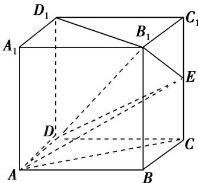
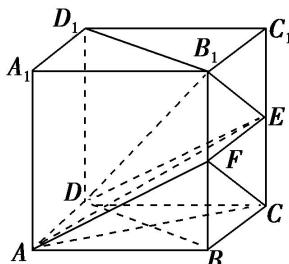

> [!faq]- 《专题08 立体几何中平行与垂直的证明问题-立体几何（文科）》例题解析
>
> > [!success]- **【答案】** 详见解析
>
> > [!note]- **【分析】**
> > 本题未单列分析。
>
> > [!note]- **【解析】**
> > (1)求证： $B_{1}D_{1}\perp AE;$
> > (2)求证： $AC / /$ 平面 $B_{1}DE$
> > 
> > 2. 解析
> > (1)连接 BD，则 $BD \parallel B_{1}D_{1}$ . ∵四边形 ABCD 是正方形，∴ $AC \perp BD$ .
> > 
> > ∵CE⊥平面ABCD，∴CE⊥BD．又AC∩CE=C，∴BD⊥平面ACE.
> > ∵AE⊂平面ACE，∴BD⊥AE，∴B₁D₁⊥AE.
> > (2)取 $BB_{1}$ 的中点 F，连接 AF，CF，EF，则 $FC \parallel B_{1}E$ ，∴ $CF \parallel$ 平面 $B_{1}DE$ .
> > ∵E，F是 $CC_{1}$ ， $BB_{1}$ 的中点，∴ $EF\parallel BC$ 。又 $BC\parallel AD$ ，∴ $EF\parallel AD$ ，
> > ∴四边形 ADEF 是平行四边形，∴AF//ED.
> > ∵ $AF \not\subset$ 平面 $B_{1}DE$ ， $ED \subset$ 平面 $B_{1}DE$ ，∴ $AF \parallel$ 平面 $B_{1}DE$ .
> > ∵ $AF \cap CF = F$ ，∴ 平面 $ACF \parallel$ 平面 $B_{1}DE$ 。又∵ $AC \subset$ 平面 ACF，∴ $AC \parallel$ 平面 $B_{1}DE$ 。
