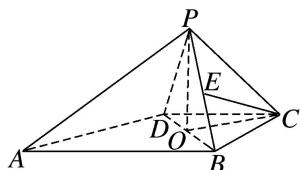
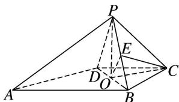

> [!faq]- 《专题08 立体几何中平行与垂直的证明问题-立体几何（文科）》例题解析
>
> > [!success]- **【答案】** 详见解析
>
> > [!note]- **【解析】**
> > 解析
> > (1) 取 BD 的中点 O，连接 CO，PO，
> >
> > 
> >
> > 因为 CD=CB，所以 $\triangle CBD$ 为等腰三角形，所以 $BD\perp CO$ .
> >
> > 因为 PB=PD，所以 $\triangle PBD$ 为等腰三角形，所以 $BD \perp PO$ .
> >
> > 又 $PO \cap CO = O$ ，PO，CO⊂平面 PCO，所以 BD⊥平面 PCO.
> >
> > 因为 $PC \subset$ 平面 PCO，所以 $PC \perp BD$ .
> >
> > (2)由 E 为 PB 的中点，连接 EO，则 EO // PD，
> >
> > 
> >
> > 又 $EO \nmid$ 平面 $PAD, PD \subset$ 平面 $PAD$ , 所以 $EO \parallel$ 平面 $PAD$ .
> >
> > 由 $\angle ADB=90^{\circ}$ 及 $BD\perp CO$ ，可得 $CO\parallel AD$ ，
> >
> > 又 $CO \nmid$ 平面 $PAD, AD \subset$ 平面 $PAD$ , 所以 $CO \parallel$ 平面 $PAD$ .
> >
> > 又 $CO \cap EO = O$ ，CO， $EO \subset$ 平面 COE，所以平面 CEO // 平面 PAD，
> >
> > 而 $CE \subset$ 平面 CEO，所以 $CE \parallel$ 平面 PAD.
