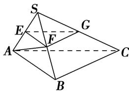

> [!faq]- 《专题08 立体几何中平行与垂直的证明问题-立体几何（文科）》例题解析
>
> > [!success]- **【答案】** 详见解析
>
> > [!note]- **【分析】**
> > 本题未单列分析。
>
> > [!note]- **【解析】**
> > (1)平面 $EFG \parallel$ 平面 $ABC$ ；
> > (2) $BC \perp SA$ .
> >
> > 
> >
> > 4. 解析
> > (1)由 AS=AB， $AF \perp SB$ 知 F 为 SB 中点，则 $EF \parallel AB$ ， $FG \parallel BC$ ，
> >
> > 又 $EF \cap FG = F$ ， $AB \cap BC = B$ ，因此平面 EFG // 平面 ABC.
> >
> > (2)由平面 $SAB \perp$ 平面 SBC，且 $AF \perp SB$ ，知 $AF \perp$ 平面 SBC，则 $AF \perp BC$ .
> >
> > 又 $BC \perp AB$ ， $AF \cap AB = A$ ，则 $BC \perp$ 平面 SAB，又 $SA \subset$ 平面 SAB，因此 $BC \perp SA$ .
