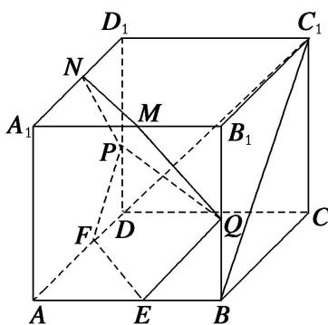
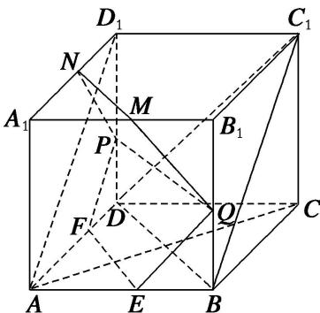

<!-- question-source:start -->
[例 1](2014·湖北)如图，在正方体 $ABCD-A_{1}B_{1}C_{1}D_{1}$ 中，E, F, P, Q, M, N 分别是棱 AB, AD, $DD_{1}$ , $BB_{1}$ , $A_{1}B_{1}$ , $A_{1}D_{1}$ 的中点．求证：

(1)直线 $BC_{1} / /$ 平面 $EFPQ$ ;

(2)直线 $AC_{1} \perp$ 平面 PQMN.

(1)如图，连接 $AD_{1}$ ，由 $ABCD - A_{1}B_{1}C_{1}D_{1}$ 是正方体，知 $AD_{1} \parallel BC_{1}$ ，因为 $F$ ， $P$ 分别是 $AD$ ， $DD_{1}$ 的中点，所以 $FP \parallel AD_{1}$ ，从而 $BC_{1} \parallel FP$ 。而 $FP \subset$ 平面 $EFPQ$ ，且 $BC_{1} \not\subset$ 平面 $EFPQ$ ，故直线 $BC_{1} \parallel$ 平面 $EFPQ$ 。

(2)连接 AC, BD, 则 $AC \perp BD$ . 由 $CC_{1} \perp$ 平面 ABCD, $BD \subset$ 平面 ABCD, 可得 $CC_{1} \perp BD$ .

又 $AC \cap CC_{1} = C$ ，所以 $BD \perp$ 平面 $ACC_{1}$ 。而 $AC_{1} \subset$ 平面 $ACC_{1}$ ，所以 $BD \perp AC_{1}$ 。

因为 M, N 分别是 $A_{1}B_{1}$ , $A_{1}D_{1}$ 的中点，所以 $MN \parallel BD$ ，从而 $MN \perp AC_{1}$ .

同理可证 $PN \perp AC_{1}$ 。又 $PN \cap MN = N$ ，所以直线 $AC_{1} \perp$ 平面 PQMN。
<!-- question-source:end -->

![[高中/总复习/专题/立体几何/专题08 立体几何中平行与垂直的证明问题-立体几何（文科）/考点02_线线_线面__面面_平行_线面垂直问题/例题/answers/Q00043574A1.md]]
