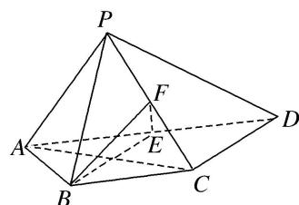

<!-- question-source:start -->
[例 2]如图，四棱锥 P-ABCD 中，AP⊥平面 PCD，AD∥BC， $AB=BC=\frac{1}{2}AD$ ，E，F 分别为线段 AD，PC 的中点．求证：

(1)AP//平面 BEF;

(2) $BE \perp$ 平面 PAC.

<!-- question-source:end -->

![[高中/总复习/专题/立体几何/专题08 立体几何中平行与垂直的证明问题-立体几何（文科）/考点02_线线_线面__面面_平行_线面垂直问题/例题/answers/Q00043575A1.md]]
