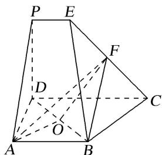

<!-- question-source:start -->
[例3]如图，在多面体 $ABCDPE$ 中，四边形 $ABCD$ 和 $CDPE$ 都是直角梯形， $AB // DC, PE // DC, AD \perp DC, PD \perp$ 平面 $ABCD$ ， $AB = PD = DA = 2PE, CD = 3PE, F$ 是 $CE$ 的中点.

(1)求证： $BF \parallel$ 平面 ADP;

(2)已知 O 是 BD 的中点，求证： $BD \perp$ 平面 AOF.

(1)如图, 取 $PD$ 的中点为 $G$ , 连接 $FG$ , $AG$ ,

∵F是CE的中点，∴FG是梯形CDPE的中位线，∵CD=3PE，∴FG=2PE，FG//CD，

∵ CD // AB，AB = 2PE，∴ AB // FG，AB = FG，即四边形 ABFG 是平行四边形，

∴BF//AG，又BF≠平面ADP，AG⊂平面ADP，∴BF//平面ADP.

(2)延长 AO 交 CD 于 M，连接 BM，FM，∵ BA⊥AD，CD⊥DA，AB=AD，O 为 BD 的中点，

∴ABMD 是正方形，则 $BD \perp AM$ ，MD = 2PE. ∴FM // PD，

∵PD⊥平面ABCD，∴FM⊥平面ABCD，∴FM⊥BD，

∵AM∩FM=M，∴BD⊥平面AMF，∴BD⊥平面AOF.
<!-- question-source:end -->

![[高中/总复习/专题/立体几何/专题08 立体几何中平行与垂直的证明问题-立体几何（文科）/考点02_线线_线面__面面_平行_线面垂直问题/例题/answers/Q00043576A1.md]]
