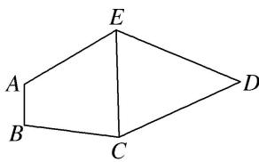
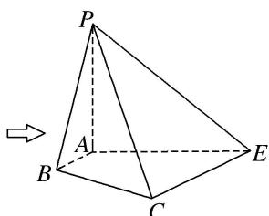

<!-- question-source:start -->
[例 5]如图 1，在平面五边形 ABCDE 中， $AB \parallel CE$ ，且 AE=2， $\angle AEC=60^{\circ}$ ， $CD=ED=\sqrt{7}$ ， $\cos\angle EDC=\frac{5}{7}$ 。将 $\triangle CDE$ 沿 CE 折起，使点 D 到 P 的位置，且 $AP=\sqrt{3}$ ，得到如图 2 所示的四棱锥 P-ABCE。

(1)求证： $AP \perp$ 平面 ABCE;

(2)记平面 PAB 与平面 PCE 相交于直线 l，求证： $AB \parallel l$ .

  
图 1

  
图2

(1)在 $\triangle CDE$ 中， $\because CD=ED=\sqrt{7}$ , $\cos\angle EDC=\frac{5}{7}$ ,

由余弦定理得 $CE = \sqrt{(\sqrt{7})^2 + (\sqrt{7})^2 - 2 \times \sqrt{7} \times \sqrt{7} \times \frac{5}{7}} = 2.$

连接 AC，∵AE=2， $\angle AEC=60^{\circ}$ ，∴AC=2。又 $AP=\sqrt{3}$ ，∴在 $\triangle PAE$ 中， $AP^{2}+AE^{2}=PE^{2}$ ，即 $AP\perp AE$ 。同理， $AP\perp AC$ 。

$\because AC\cap AE=A,\ AC\subset$ 平面 ABCE, $AE\subset$ 平面 ABCE, $\therefore AP\perp$ 平面 ABCE.

(2)∵AB//CE，且CE⊂平面PCE，AB∉平面PCE，∴AB//平面PCE.

又平面 $PAB \cap$ 平面 $PCE = l, \therefore AB \parallel l.$
<!-- question-source:end -->

![[高中/总复习/专题/立体几何/专题08 立体几何中平行与垂直的证明问题-立体几何（文科）/考点02_线线_线面__面面_平行_线面垂直问题/例题/answers/Q00043578A1.md]]
