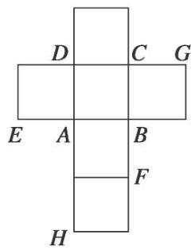
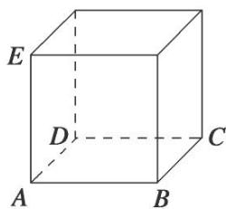

<!-- question-source:start -->
[例 6] (2015·四川)一个正方体的平面展开图及该正方体的直观图的示意图如图所示.

(1)请将字母 F, G, H 标记在正方体相应的顶点处(不需说明理由);

(2)判断平面 BEG 与平面 ACH 的位置关系．并证明你的结论；

(3)证明：直线 $DF \perp$ 平面 BEG.

<!-- question-source:end -->

![[高中/总复习/专题/立体几何/专题08 立体几何中平行与垂直的证明问题-立体几何（文科）/考点02_线线_线面__面面_平行_线面垂直问题/例题/answers/Q00043579A1.md]]
