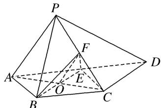

> [!faq]- 《专题08 立体几何中平行与垂直的证明问题-立体几何（文科）》例题解析
>
> > [!success]- **【答案】** 详见解析
>
> > [!note]- **【分析】**
> > 本题未单列分析。
>
> > [!note]- **【解析】**
> > (1)AP//平面 BEF;
> > (2) $BE \perp$ 平面 PAC.
> > 
> > 解析 (1)设 $AC \cap BE = O$ ，连接 $OF$ ， $EC$ ，如图所示。由于 $E$ 为 $AD$ 的中点， $AB = BC = \frac{1}{2} AD$ ， $AD // BC$ ，
> > 所以 $AE \parallel BC$ ，AE = AB = BC，因此四边形 ABCE 为菱形，所以 O 为 AC 的中点.
> > 又 F 为 PC 的中点，因此在 $\triangle PAC$ 中，可得 AP // OF.
> > 又 $OF \subset$ 平面 $BEF$ , $AP \notin$ 平面 $BEF$ . 所以 $AP \parallel$ 平面 $BEF$ .
> > 
> > (2)由题意知 $ED \parallel BC$ ，ED = BC。所以四边形 BCDE 为平行四边形，因此 $BE \parallel CD$ 。
> > 又 $AP \perp$ 平面 PCD，所以 $AP \perp CD$ ，因此 $AP \perp BE$ .
> > 因为四边形 $ABCE$ 为菱形，所以 $BE \perp AC$ 。又 $AP \cap AC = A$ ， $AP, AC \subset$ 平面 $PAC$ ，所以 $BE \perp$ 平面 $PAC$ .
