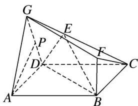

> [!faq]- 《专题08 立体几何中平行与垂直的证明问题-立体几何（文科）》例题解析
>
> > [!success]- **【答案】** 详见解析
>
> > [!note]- **【分析】**
> > 本题未单列分析。
>
> > [!note]- **【解析】**
> > (1)求证： $AP \perp$ 平面 GCD;
> > (2)求证：平面 ADG // 平面 FBC.
> > 
> > 解析 (1)因为 $\triangle GAD$ 是等边三角形，点 $P$ 为线段 $GD$ 的中点，所以 $AP \perp GD$ .
> > 因为 $AD \perp CD$ ， $GD \perp CD$ ，且 $AD \cap GD = D$ ，AD， $GD \subset$ 平面 GAD，故 $CD \perp$ 平面 GAD，
> > AP⊂平面GAD，所以CD⊥AP，又CD∩GD=D，CD，GD⊂平面GCD，所以AP⊥平面GCD.
> > (2)因为 $BF \perp$ 平面 ABCD， $CD \subset$ 平面 ABCD，所以 $BF \perp CD$ ，
> > 因为 $BC \perp CD$ ， $BF \cap BC = B$ ，BF， $BC \subset$ 平面 FBC，
> > 所以 $CD \perp$ 平面 FBC，由(1)知 $CD \perp$ 平面 GAD，所以平面 ADG // 平面 FBC.
