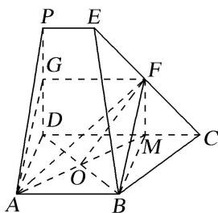

> [!faq]- 《专题08 立体几何中平行与垂直的证明问题-立体几何（文科）》例题解析
>
> > [!success]- **【答案】** 详见解析
>
> > [!note]- **【分析】**
> > 本题未单列分析。
>
> > [!note]- **【解析】**
> > 解析
> > (1)如图, 取 $PD$ 的中点为 $G$ , 连接 $FG$ , $AG$ ,
> >
> > 
> >
> > ∵F是CE的中点，∴FG是梯形CDPE的中位线，∵CD=3PE，∴FG=2PE，FG//CD，
> >
> > ∵ CD // AB，AB = 2PE，∴ AB // FG，AB = FG，即四边形 ABFG 是平行四边形，
> >
> > ∴BF//AG，又BF≠平面ADP，AG⊂平面ADP，∴BF//平面ADP.
> >
> > (2)延长 AO 交 CD 于 M，连接 BM，FM，∵ BA⊥AD，CD⊥DA，AB=AD，O 为 BD 的中点，
> >
> > ∴ABMD 是正方形，则 $BD \perp AM$ ，MD = 2PE. ∴FM // PD，
> >
> > ∵PD⊥平面ABCD，∴FM⊥平面ABCD，∴FM⊥BD，
> >
> > ∵AM∩FM=M，∴BD⊥平面AMF，∴BD⊥平面AOF.
