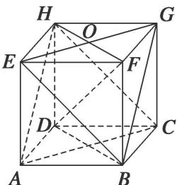

> [!faq]- 《专题08 立体几何中平行与垂直的证明问题-立体几何（文科）》例题解析
>
> > [!success]- **【答案】** 详见解析
>
> > [!note]- **【解析】**
> > 解析
> > (1)点 F, G, H 的位置如图所示.
> >
> > 
> >
> > (2)平面 BEG // 平面 ACH，证明如下：
> >
> > 因为 ABCD-EFGH 为正方体，所以 BC//FG，BC=FG，又 FG//EH，FG=EH，
> >
> > 所以 $BC \parallel EH$ ， $BC = EH$ ，于是 $BCHE$ 为平行四边形，所以 $BE \parallel CH$ ，又 $CH \subset$ 平面 $ACH$ ， $BE \nmid$ 平面 $ACH$ ，所以 $BE \parallel$ 平面 $ACH$ ，同理 $BG \parallel$ 平面 $ACH$ ，又 $BE \cap BG = B$ ，所以平面 $BEG \parallel$ 平面 $ACH$ .
> >
> > (3)连接 FH, BD. 因为 ABCD-EFGH 为正方体，所以 DH⊥平面 EFGH,
> >
> > 因为 $EG \subset$ 平面 $EFGH$ ，所以 $DH \perp EG$ ，又 $EG \perp FH$ ， $EG \cap FH = O$ ，所以 $EG \perp$ 平面 $BFHD$ ，又 $DF \subset$ 平面 $BFHD$ ，所以 $DF \perp EG$ ，同理 $DF \perp BG$ ，又 $EG \cap BG = G$ ，所以 $DF \perp$ 平面 $BEG$ .
