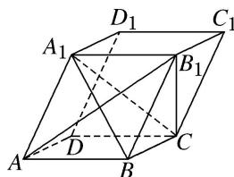

<!-- question-source:start -->
[例 1](2018·江苏)在平行六面体 $ABCD-A_{1}B_{1}C_{1}D_{1}$ 中， $AA_{1}=AB$ ， $AB_{1}\perp B_{1}C_{1}$ .

求证：
(1) $AB \parallel$ 平面 $A_{1}B_{1}C$ ;
(2)平面 $ABB_{1}A_{1} \perp$ 平面 $A_{1}BC$ .

(1)在平行六面体 $ABCD-A_{1}B_{1}C_{1}D_{1}$ 中， $AB \parallel A_{1}B_{1}$ .

因为 $AB \not\subset$ 平面 $A_{1}B_{1}C$ ， $A_{1}B_{1} \subset$ 平面 $A_{1}B_{1}C$ ，所以 $AB \parallel$ 平面 $A_{1}B_{1}C$ .

(2)在平行六面体 $ABCD-A_{1}B_{1}C_{1}D_{1}$ 中，四边形 $ABB_{1}A_{1}$ 为平行四边形.

又因为 $AA_{1}=AB$ ，所以四边形 $ABB_{1}A_{1}$ 为菱形，因此 $AB_{1}\perp A_{1}B$ .

因为 $AB_{1} \perp B_{1}C_{1}$ ， $BC \parallel B_{1}C_{1}$ ，所以 $AB_{1} \perp BC$ .

因为 $A_{1}B \cap BC = B,\ A_{1}B \subset$ 平面 $A_{1}BC,\ BC \subset$ 平面 $A_{1}BC$ ，所以 $AB_{1} \perp$ 平面 $A_{1}BC$ .

因为 $AB_{1} \subset$ 平面 $ABB_{1}A_{1}$ ，所以平面 $ABB_{1}A_{1} \perp$ 平面 $A_{1}BC$ .
<!-- question-source:end -->

![[高中/总复习/专题/立体几何/专题08 立体几何中平行与垂直的证明问题-立体几何（文科）/考点03_线面平行_面面垂直问题/例题/answers/Q00043580A1.md]]
