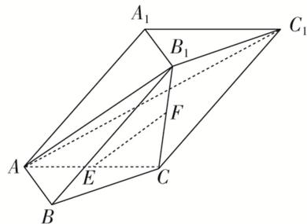

<!-- question-source:start -->
[例 2](2020·江苏)在三棱柱 $ABC-A_{1}B_{1}C_{1}$ 中， $AB\perp AC$ ， $B_{1}C\perp$ 平面 ABC，E，F 分别是 AC， $B_{1}C$ 的中

点.

(1)求证： $EF \parallel$ 平面 $AB_{1}C_{1}$ ;

(2)求证：平面 $AB_{1}C \perp$ 平面 $ABB_{1}$ .

<!-- question-source:end -->

![[高中/总复习/专题/立体几何/专题08 立体几何中平行与垂直的证明问题-立体几何（文科）/考点03_线面平行_面面垂直问题/例题/answers/Q00043581A1.md]]
