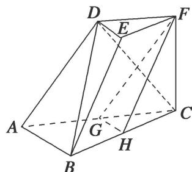
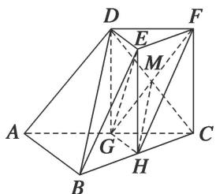

<!-- question-source:start -->
[例 5](2015·山东)如图，三棱台 DEF-ABC 中，AB=2DE，G，H 分别为 AC，BC 的中点.

(1)求证： $BD \parallel$ 平面FGH;

(2)若 $CF \perp BC$ ， $AB \perp BC$ ，求证：平面 BCD ⊥ 平面 EGH.

(1)方法一 连接 $DG$ ，设 $CD \cap GF = M$ ，连接 $MH$ 。在三棱台 $DEF - ABC$ 中， $AB = 2DE$ ， $G$ 为 $AC$ 的中点，可得 $DF \parallel GC$ ， $DF = GC$ ，所以四边形 $DFCG$ 为平行四边形。则 $M$ 为 $CD$ 的中点，又 $H$ 为 $BC$ 的中点，所以 $HM \parallel BD$ ，又 $HM \subset$ 平面 $FGH$ ， $BD \nmid$ 平面 $FGH$ ，所以 $BD \parallel$ 平面 $FGH$ 。

方法二 在三棱台 DEF-ABC 中，由 BC=2EF，H 为 BC 的中点，可得 BH//EF，BH=EF，

所以四边形 HBEF 为平行四边形，可得 BE // HF。在 $\triangle ABC$ 中，G 为 AC 的中点，

H 为 BC 的中点，所以 GH // AB. 又 GH ∩ HF = H，所以平面 FGH // 平面 ABED.

又因为 $BD \subset$ 平面 ABED，所以 $BD \parallel$ 平面 FGH.

(2)连接 $HE, GE$ . 因为 $G, H$ 分别为 $AC, BC$ 的中点，所以 $GH \parallel AB$ .

由 $AB \perp BC$ ，得 $GH \perp BC$ 。又 H 为 BC 的中点，所以 $EF \parallel HC$ ，EF = HC，

因此四边形 EFCH 是平行四边形，所以 $CF \parallel HE$ 。又 $CF \perp BC$ ，所以 $HE \perp BC$ 。

又 $HE, GH \subset$ 平面 $EGH, HE \cap GH = H$ , 所以 $BC \perp$ 平面 $EGH$ .

又 $BC \subset$ 平面 BCD，所以平面 $BCD \perp$ 平面 EGH.
<!-- question-source:end -->

![[高中/总复习/专题/立体几何/专题08 立体几何中平行与垂直的证明问题-立体几何（文科）/考点03_线面平行_面面垂直问题/例题/answers/Q00043584A1.md]]
