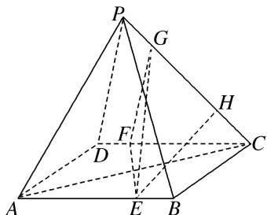

<!-- question-source:start -->
[例6]如图，在四棱锥 $P - ABCD$ 中，底面ABCD是矩形，且 $AB = \sqrt{2} BC$ ， $E$ ， $F$ 分别在线段 $AB$ ， $CD$ 上， $G$ ， $H$ 在线段 $PC$ 上， $EF\bot PA$ ，且 $\frac{BE}{BA} = \frac{DF}{DC} = \frac{PG}{PC} = \frac{CH}{CP} = \frac{1}{4}$ 求证：

(1) $EH \parallel$ 平面 PAD;

(2)平面 $EFG \perp$ 平面 $PAC$ .

<!-- question-source:end -->

![[高中/总复习/专题/立体几何/专题08 立体几何中平行与垂直的证明问题-立体几何（文科）/考点03_线面平行_面面垂直问题/例题/answers/Q00043585A1.md]]
