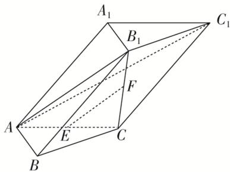

> [!faq]- 《专题08 立体几何中平行与垂直的证明问题-立体几何（文科）》例题解析
>
> > [!success]- **【答案】** 详见解析
>
> > [!note]- **【分析】**
> > 本题未单列分析。
>
> > [!note]- **【解析】**
> > (1)求证： $EF \parallel$ 平面 $AB_{1}C_{1}$ ;
> > (2)求证：平面 $AB_{1}C \perp$ 平面 $ABB_{1}$ .
> > 
> > 解析 (1)由于 E, F 分别是 AC, $B_{1}C$ 的中点，所以 $EF \parallel AB_{1}$ .
> > 由于 $EF \not\subset$ 平面 $AB_{1}C_{1}$ ， $AB_{1} \subset$ 平面 $AB_{1}C_{1}$ ，所以 $EF \parallel$ 平面 $AB_{1}C_{1}$ .
> > 
> > (2)由于 $B_{1}C \perp$ 平面 ABC， $AB \subset$ 平面 ABC，所以 $B_{1}C \perp AB$ .
> > 由于 $AB \perp AC$ ， $AC \cap B_{1}C = C$ ，所以 $AB \perp$ 平面 $AB_{1}C$ ，
> > 由于 $AB \subset$ 平面 $ABB_{1}$ ，所以平面 $AB_{1}C \perp$ 平面 $ABB_{1}$ .
