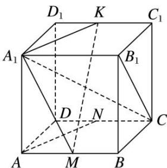
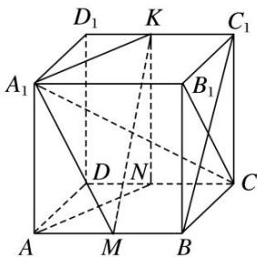

> [!faq]- 《专题08 立体几何中平行与垂直的证明问题-立体几何（文科）》例题解析
>
> > [!success]- **【答案】** 详见解析
>
> > [!note]- **【分析】**
> > 本题未单列分析。
>
> > [!note]- **【解析】**
> > (2)平面 $A_{1}B_{1}C \perp$ 平面 $A_{1}MK$ .
> > 解析 (1)如图所示, 连接 $NK$ 。在正方体 $ABCD—A_{1}B_{1}C_{1}D_{1}$ 中,
> > 
> > ∵四边形 $AA_{1}D_{1}D$ ， $DD_{1}C_{1}C$ 都为正方形，∴ $AA_{1} // DD_{1}$ ， $AA_{1} = DD_{1}$ ，
> > $C_{1}D_{1}//CD,\quad C_{1}D_{1}=CD.\quad\because N,\quad K$ 分别为 CD， $C_{1}D_{1}$ 的中点，
> > $\therefore DN\parallel D_{1}K,\ DN=D_{1}K,\ \therefore$ 四边形 $DD_{1}KN$ 为平行四边形，
> > $$
> > \therefore K N \parallel D D _ {1}, K N = D D _ {1}, \therefore A A _ {1} \parallel K N, A A _ {1} = K N,
> > $$
> > ∴四边形 $AA_{1}KN$ 为平行四边形，∴ $AN \parallel A_{1}K$ .
> > 又∵ $A_{1}K\subset$ 平面 $A_{1}MK$ ， $AN\not\subset$ 平面 $A_{1}MK$ ，∴AN//平面 $A_{1}MK$ .
> > 
> > (2)如图所示，连接 $BC_{1}$ 。在正方体 $ABCD - A_{1}B_{1}C_{1}D_{1}$ 中， $AB \parallel C_{1}D_{1}$ ， $AB = C_{1}D_{1}$ 。 $\because M, K$ 分别为 $AB, C_{1}D_{1}$ 的中点， $\therefore BM \parallel C_{1}K, BM = C_{1}K,$ $\therefore$ 四边形 $BC_{1}KM$ 为平行四边形， $\therefore MK \parallel BC_{1}$ 。
> > 在正方体 $ABCD - A_{1}B_{1}C_{1}D_{1}$ 中， $A_{1}B_{1} \perp$ 平面 $BB_{1}C_{1}C, BC_{1} \subset$ 平面 $BB_{1}C_{1}C, \therefore A_{1}B_{1} \perp BC_{1}$ 。 $\because MK \parallel BC_{1}, \therefore A_{1}B_{1} \perp MK.$ $\because$ 四边形 $BB_{1}C_{1}C$ 为正方形， $\therefore BC_{1} \perp B_{1}C, \therefore MK \perp B_{1}C.$ $\because A_{1}B_{1} \subset$ 平面 $A_{1}B_{1}C, B_{1}C \subset$ 平面 $A_{1}B_{1}C, A_{1}B_{1} \cap B_{1}C = B_{1}, \therefore MK \perp$ 平面 $A_{1}B_{1}C.$ 又 $\because MK \subset$ 平面 $A_{1}MK, \therefore$ 平面 $A_{1}B_{1}C \perp$ 平面 $A_{1}MK.$
