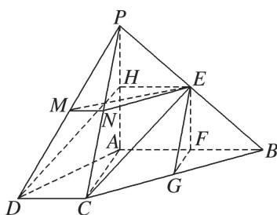
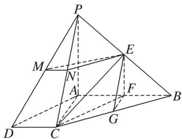

> [!faq]- 《专题08 立体几何中平行与垂直的证明问题-立体几何（文科）》例题解析
>
> > [!success]- **【答案】** 详见解析
>
> > [!note]- **【分析】**
> > 本题未单列分析。
>
> > [!note]- **【解析】**
> > 解析
> > (1)方法一 取 $PA$ 的中点 $H$ , 连接 $EH, DH$ . 因为 $E$ 为 $PB$ 的中点, 所以 $EH \parallel \frac{1}{2} AB$ . 又 $CD \parallel \frac{1}{2} AB$ , 所以 $EH \parallel CD$ . 所以四边形 $DCEH$ 是平行四边形, 所以 $CE \parallel DH$ . 又 $DH \subset$ 平面 $PAD$ , $CE \not\subset$ 平面 $PAD$ , 所以 $CE \parallel$ 平面 $PAD$ .
> >
> > 
> >
> > 方法二 连接 CF. 因为 F 为 AB 的中点，所以 $AF=\frac{1}{2}AB$ . 又 $CD=\frac{1}{2}AB$ ，所以 AF=CD.
> > 又 $AF \parallel CD$ ，所以四边形 AFCD 为平行四边形.
> >
> > 因此 $CF \parallel AD$ ，又 $CF \nsubseteq$ 平面 $PAD$ ， $AD \subset$ 平面 $PAD$ ，所以 $CF \parallel$ 平面 $PAD$ .
> >
> > 因为 E, F 分别为 PB, AB 的中点，所以 $EF \parallel PA$ .
> >
> > 又 $EF \not\subset$ 平面 PAD， $PA \subset$ 平面 PAD，所以 $EF \parallel$ 平面 PAD.
> >
> > 因为 $CF \cap EF = F$ ，故平面 CEF // 平面 PAD.
> >
> > 又 $CE \subset$ 平面 $CEF$ ，所以 $CE \parallel$ 平面 $PAD$ .
> >
> > 
> >
> > (2)因为 E, F 分别为 PB, AB 的中点，所以 $EF \parallel PA$ .
> >
> > 又因为 $AB \perp PA$ ，所以 $EF \perp AB$ ，同理可证 $AB \perp FG$ .
> >
> > 又因为 $EF \cap FG = F$ ，EF， $FG \subset$ 平面 EFG，所以 $AB \perp$ 平面 EFG.
> >
> > 又因为 M, N 分别为 PD, PC 的中点，所以 $MN \parallel CD$ ，又 $AB \parallel CD$ ，所以 $MN \parallel AB$ ，
> >
> > 所以 $MN \perp$ 平面 EFG. 又因为 $MN \subset$ 平面 EMN, 所以平面 $EFG \perp$ 平面 EMN.
