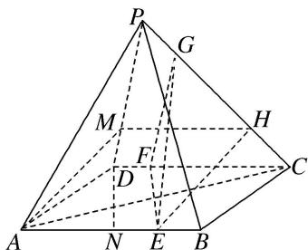

> [!faq]- 《专题08 立体几何中平行与垂直的证明问题-立体几何（文科）》例题解析
>
> > [!success]- **【答案】** 详见解析
>
> > [!note]- **【解析】**
> > 解析
> > (1)如图，在 $PD$ 上取点 $M$ ，使得 $\frac{DM}{DP} = \frac{1}{4}$ ，连接 $AM, MH$ ，则 $\frac{DM}{DP} = \frac{CH}{CP} = \frac{1}{4}$ ，所以 $MH = \frac{3}{4} DC, MH // CD$ ，又 $AE = \frac{3}{4} AB$ ，四边形ABCD是矩形，
> >
> > 所以 MH=AE, MH//AE，所以四边形 AEHM 为平行四边形，所以 EH//AM，又 AM⊂平面 PAD, EH∉平面 PAD，所以 EH//平面 PAD.
> >
> > 
> >
> > (2)取 AB 的中点 N，连接 DN，则 $NE = DF$ ， $NE \parallel DF$ ，则四边形 NEFD 为平行四边形，则 $DN \parallel EF$ ，在 $\triangle DAN$ 和 $\triangle CDA$ 中， $\angle DAN = \angle CDA$ ， $\frac{AN}{DA} = \frac{1}{\sqrt{2}} = \frac{DA}{CD}$ ，则 $\triangle DAN \sim \triangle CDA$ ，
> >
> > 则 $\angle ADN = \angle DCA$ ，则 $DN \perp AC$ ，则 $EF \perp AC$ ，又 $EF \perp PA, AC \cap PA = A$ ，所以 $EF \perp$ 平面 PAC，
> >
> > 又 $EF \subset$ 平面 EFG，所以平面 $EFG \perp$ 平面 PAC.
> >
> > ## 【对点训练】
