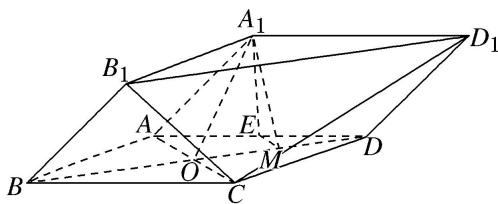

<!-- question-source:start -->
3. (2017·山东)由四棱柱 $ABCD - A_{1}B_{1}C_{1}D_{1}$ 截去三棱锥 $C_{1} - B_{1}CD_{1}$ 后得到的几何体如图所示。四边形 $ABCD$ 为正方形， $O$ 为 $AC$ 与 $BD$ 的交点， $E$ 为 $AD$ 的中点， $A_{1}E \perp$ 平面 $ABCD$ 。

(1)证明： $A_{1}O \parallel$ 平面 $B_{1}CD_{1}$ ;

(2)设 M 是 OD 的中点，证明：平面 $A_{1}EM \perp$ 平面 $B_{1}CD_{1}$ .

<!-- question-source:end -->

![[高中/总复习/专题/立体几何/专题08 立体几何中平行与垂直的证明问题-立体几何（文科）/考点03_线面平行_面面垂直问题/对点训练/answers/Q00043588A1.md]]
