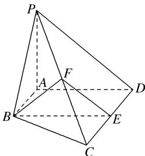

<!-- question-source:start -->
4. 如图，在四棱锥 $P - ABCD$ 中， $AB \parallel CD$ ， $AB \perp AD$ ， $CD = 2AB$ ，平面 $PAD \perp$ 底面 $ABCD$ ， $PA \perp AD$ ， $E$ ， $F$ 分别是 $CD$ ， $PC$ 的中点.

求证：
(1) $BE \parallel$ 平面 PAD；
(2)平面 $BEF \perp$ 平面 PCD.

<!-- question-source:end -->

![[高中/总复习/专题/立体几何/专题08 立体几何中平行与垂直的证明问题-立体几何（文科）/考点03_线面平行_面面垂直问题/对点训练/answers/Q00043589A1.md]]
