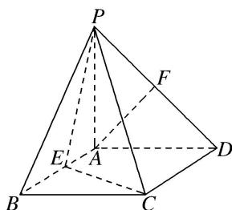

<!-- question-source:start -->
6. 如图, 四棱锥 $P - ABCD$ 的底面是矩形, $PA \perp$ 平面 $ABCD$ , $E$ , $F$ 分别是 $AB$ , $PD$ 的中点, 且 $PA = AD$ . 求证:
(1) $AF //$ 平面 $PEC$ ;
(2) 平面 $PEC \perp$ 平面 $PCD$ .

<!-- question-source:end -->

![[高中/总复习/专题/立体几何/专题08 立体几何中平行与垂直的证明问题-立体几何（文科）/考点03_线面平行_面面垂直问题/对点训练/answers/Q00043591A1.md]]
