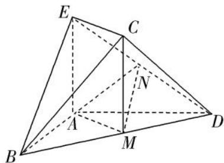

<!-- question-source:start -->
7. 如图，在几何体 $ABCDE$ 中， $AB = AD = 2$ ， $AB \perp AD$ ， $AE \perp$ 平面 $ABD$ ， $M$ 为线段 $BD$ 的中点， $MC // AE$ ，且 $AE = MC = \sqrt{2}$ .

(1)求证：平面 $BCD \perp$ 平面 CDE;

(2)若 N 为线段 DE 的中点，求证：平面 AMN// 平面 BEC.

<!-- question-source:end -->

![[高中/总复习/专题/立体几何/专题08 立体几何中平行与垂直的证明问题-立体几何（文科）/考点03_线面平行_面面垂直问题/对点训练/answers/Q00043592A1.md]]
