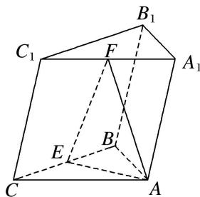
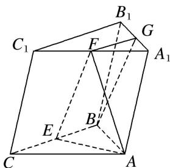

> [!faq]- 《专题08 立体几何中平行与垂直的证明问题-立体几何（文科）》例题解析
>
> > [!success]- **【答案】** 详见解析
>
> > [!note]- **【分析】**
> > 本题未单列分析。
>
> > [!note]- **【解析】**
> > (1)求证： $EF \parallel$ 平面 $ABB_{1}A_{1}$ ;
> > (2)求证：平面 $AEF \perp$ 平面 $BCC_{1}B_{1}$ .
> > 
> > 2. 解析 (1)如图, 取 $A_{1}B_{1}$ 的中点 $G$ , 连接 $BG$ , $FG$ , 在 $\triangle A_{1}B_{1}C_{1}$ 中,
> > 因为 F, G 分别为 $A_{1}C_{1}$ , $A_{1}B_{1}$ 的中点，所以 $FG \parallel B_{1}C_{1}$ ，且 $FG = \frac{1}{2}B_{1}C_{1}$ .
> > 
> > 在三棱柱 $ABC-A_{1}B_{1}C_{1}$ 中， $BC \parallel B_{1}C_{1}$ ．又 E 为棱 BC 的中点，所以 $FG \parallel BE$ ，且 FG = BE，
> > 所以四边形 BEFG 为平行四边形，所以 $EF \parallel BG$ ，
> > 又因为 $BG \subset$ 平面 $ABB_{1}A_{1}$ ， $EF \nsubseteq$ 平面 $ABB_{1}A_{1}$ ，所以 $EF \parallel$ 平面 $ABB_{1}A_{1}$ .
> > (2)在 $\triangle ABC$ 中，因为 $AB=AC$ ， $E$ 为 $BC$ 的中点，所以 $AE\perp BC$ ，
> > 又侧面 $BCC_{1}B_{1} \perp$ 底面 ABC，侧面 $BCC_{1}B_{1} \cap$ 底面 ABC = BC，且 $AE \subset$ 平面 ABC，
> > 所以 $AE \perp$ 平面 $BCC_{1}B_{1}$ ，又 $AE \subset$ 平面 AEF，所以平面 $AEF \perp$ 平面 $BCC_{1}B_{1}$ .
