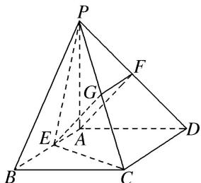

> [!faq]- 《专题08 立体几何中平行与垂直的证明问题-立体几何（文科）》例题解析
>
> > [!success]- **【答案】** 详见解析
>
> > [!note]- **【分析】**
> > 本题未单列分析。
>
> > [!note]- **【解析】**
> > 解析 (1)取 PC 的中点 G，连接 FG，EG，∵F 为 PD 的中点，G 为 PC 的中点，
> > ∴FG 为△CDP 的中位线，∴FG // CD， $FG=\frac{1}{2}CD$ .
> > ∵四边形 ABCD 为矩形，E 为 AB 的中点，∴ $AE \parallel CD$ ， $AE = \frac{1}{2} CD$ .
> > ∴ FG = AE, $FG \parallel AE$ , ∴ 四边形 AEGF 是平行四边形,
> > ∴AF//EG，又EG⊂平面PEC，AF∉平面PEC，∴AF//平面PEC.
> > 
> > (2) $\because PA=AD,\ F$ 为PD中点， $\therefore AF\perp PD,$
> > ∵ PA⊥平面 ABCD，CD⊂平面 ABCD，∴ PA⊥CD，
> > 又∵CD⊥AD，AD∩PA=A，∴CD⊥平面PAD，∵AF⊂平面PAD，∴CD⊥AF.
> > 又 $PD \cap CD = D$ ， $\therefore AF \perp$ 平面 $PCD$ .
> > 由(1)知 $EG \parallel AF$ ， $\therefore EG \perp$ 平面 $PCD$ ，又 $EG \subset$ 平面 $PEC$ ， $\therefore$ 平面 $PEC \perp$ 平面 $PCD$ .
