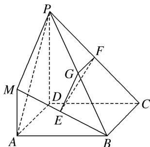

> [!faq]- 《专题08 立体几何中平行与垂直的证明问题-立体几何（文科）》例题解析
>
> > [!success]- **【答案】** 详见解析
>
> > [!note]- **【分析】**
> > 本题未单列分析。
>
> > [!note]- **【解析】**
> > (1)求证：平面 EFG // 平面 PMA;
> > (2)求证：平面 $EFG \perp$ 平面 $PDC$ .
> > 
> > 8. 解析 (1)∵E, G, F分别为MB, PB, PC的中点，∴EG//PM, GF//BC.
> > 又∵四边形 ABCD 是正方形，∴BC∥AD，∴GF∥AD.
> > ∵EG，GF在平面PMA外，PM，AD在平面PMA内，∴EG//平面PMA，GF//平面PMA.
> > 又∵EG，GF都在平面EFG内且相交，∴平面 $EFG \parallel$ 平面PMA.
> > (2)由已知 $MA \perp$ 平面 ABCD， $PD \parallel MA$ ，∴ $PD \perp$ 平面 ABCD.
> > 又 $BC \subset$ 平面 ABCD，∴ $PD \perp BC$ ．∵ 四边形 ABCD 为正方形，∴ $BC \perp DC$ ．
> > 又 $PD \cap DC = D,\quad \therefore BC \perp$ 平面 PDC. 由(1)知 $GF \parallel BC,\quad \therefore GF \perp$ 平面 PDC.
> > 又 $GF \subset$ 平面 EFG，∴平面 $EFG \perp$ 平面 PDC.
