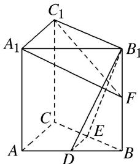

> [!faq]- 《专题08 立体几何中平行与垂直的证明问题-立体几何（文科）》例题解析
>
> > [!success]- **【答案】** 详见解析
>
> > [!note]- **【分析】**
> > 本题未单列分析。
>
> > [!note]- **【解析】**
> > (1)直线 $DE \parallel$ 平面 $A_{1}C_{1}F$ ；
> > (2)平面 $B_{1}DE \perp$ 平面 $A_{1}C_{1}F$ .
> >
> > 
> >
> > 1. 解析
> > (1)在直三棱柱 $ABC - A_{1}B_{1}C_{1}$ 中， $AC \parallel A_{1}C_{1}$ ，在 $\triangle ABC$ 中，
> >
> > 因为 D, E 分别为 AB, BC 的中点. 所以 $DE \parallel AC$ , 于是 $DE \parallel A_{1}C_{1}$ ,
> >
> > 又因为 $DE \not\subset$ 平面 $A_{1}C_{1}F$ ， $A_{1}C_{1} \subset$ 平面 $A_{1}C_{1}F$ ，所以直线 $DE \parallel$ 平面 $A_{1}C_{1}F$ .
> >
> > (2)在直三棱柱 $ABC - A_{1}B_{1}C_{1}$ 中， $AA_{1} \perp$ 平面 $A_{1}B_{1}C_{1}$ ，因为 $A_{1}C_{1} \subset$ 平面 $A_{1}B_{1}C_{1}$ ，所以 $AA_{1} \perp A_{1}C_{1}$ ，
> >
> > 又因为 $A_{1}C_{1}\perp A_{1}B_{1}$ ， $A_{1}B_{1}\cap AA_{1}=A_{1}$ ， $AA_{1}\subset$ 平面 $ABB_{1}A_{1}$ ， $A_{1}B_{1}\subset$ 平面 $ABB_{1}A_{1}$ ，所以 $A_{1}C_{1}\perp$ 平面 $ABB_{1}A_{1}$ ，因为 $B_{1}D\subset$ 平面 $ABB_{1}A_{1}$ ，所以 $A_{1}C_{1}\perp B_{1}D$ ，
> >
> > 又因为 $B_{1}D \perp A_{1}F$ ， $A_{1}C_{1} \cap A_{1}F = A_{1}$ ， $A_{1}C_{1} \subset$ 平面 $A_{1}C_{1}F$ ， $A_{1}F \subset$ 平面 $A_{1}C_{1}F$ ，
> >
> > 所以 $B_{1}D \perp$ 平面 $A_{1}C_{1}F$ ，因为直线 $B_{1}D \subset$ 平面 $B_{1}DE$ ，所以平面 $B_{1}DE \perp$ 平面 $A_{1}C_{1}F$ .
