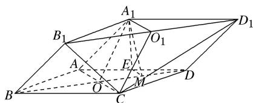

> [!faq]- 《专题08 立体几何中平行与垂直的证明问题-立体几何（文科）》例题解析
>
> > [!success]- **【答案】** 详见解析
>
> > [!note]- **【分析】**
> > 本题未单列分析。
>
> > [!note]- **【解析】**
> > (1)证明： $A_{1}O \parallel$ 平面 $B_{1}CD_{1}$ ;
> > (2)设 M 是 OD 的中点，证明：平面 $A_{1}EM \perp$ 平面 $B_{1}CD_{1}$ .
> > 
> > 3. 解析
> > (1)取 $B_{1}D_{1}$ 的中点 $O_{1}$ , 连接 $CO_{1}, A_{1}O_{1}$ , 因为 $ABCD - A_{1}B_{1}C_{1}D_{1}$ 是四棱柱, 所以 $A_{1}O_{1} // OC$ , $A_{1}O_{1} = OC$ , 因此四边形 $A_{1}OCO_{1}$ 为平行四边形, 所以 $A_{1}O // O_{1}C$ , 因为 $O_{1}C \subset$ 平面 $B_{1}CD_{1}$ , $A_{1}O \not\subset$ 平面 $B_{1}CD_{1}$ , 所以 $A_{1}O //$ 平面 $B_{1}CD_{1}$ .
> > 
> > (2)因为 E, M 分别为 AD, OD 的中点，所以 $EM \parallel AO$ 。因为 $AO \perp BD$ ，所以 $EM \perp BD$ ，又 $A_{1}E \perp$ 平面 ABCD， $BD \subset$ 平面 ABCD，所以 $A_{1}E \perp BD$ ，因为 $B_{1}D_{1} \parallel BD$ ，所以 $EM \perp B_{1}D_{1}$ ， $A_{1}E \perp B_{1}D_{1}$ ，又 $A_{1}E \subset$ 平面 $A_{1}EM$ ， $EM \subset$ 平面 $A_{1}EM$ ， $A_{1}E \cap EM = E$ ，所以 $B_{1}D_{1} \perp$ 平面 $A_{1}EM$ ，又 $B_{1}D_{1} \subset$ 平面 $B_{1}CD_{1}$ ，所以平面 $A_{1}EM \perp$ 平面 $B_{1}CD_{1}$ 。
