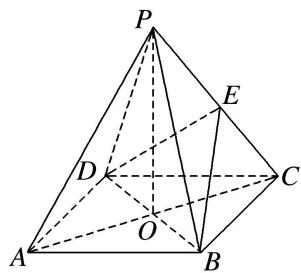
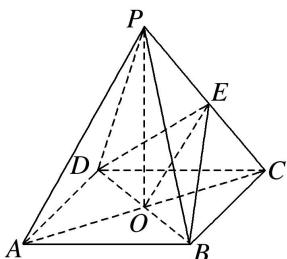

> [!faq]- 《专题08 立体几何中平行与垂直的证明问题-立体几何（文科）》例题解析
>
> > [!success]- **【答案】** 详见解析
>
> > [!note]- **【分析】**
> > 本题未单列分析。
>
> > [!note]- **【解析】**
> > (1) $PA //$ 平面 $BDE$ ;
> >
> > (2)平面 PAC⊥平面 BDE.
> >
> > 
> >
> > 5. 解析
> > (1)如图， $AC \cap BD = O$ ，连接 OE，
> >
> > 
> >
> > 在 $\triangle PAC$ 中，O 是 AC 的中点，E 是 PC 的中点，∴OE//AP，
> >
> > 又∵OE⊂平面BDE，PA≠平面BDE．∴PA∥平面BDE.
> >
> > (2) $\because PO\perp$ 底面ABCD， $BD\subset$ 底面ABCD， $\therefore PO\perp BD,$
> >
> > 又∵ $AC\perp BD$ ，且 $AC\cap PO=O$ ， $AC\subset$ 平面PAC， $PO\subset$ 平面PAC，
> >
> > ∴ BD⊥平面 PAC，而 BD⊂平面 BDE，∴ 平面 PAC⊥平面 BDE.
