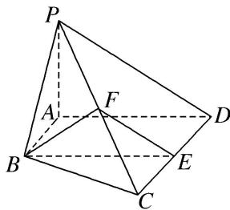

> [!faq]- 《专题08 立体几何中平行与垂直的证明问题-立体几何（文科）》例题解析
>
> > [!success]- **【答案】** 详见解析
>
> > [!note]- **【分析】**
> > 本题未单列分析。
>
> > [!note]- **【解析】**
> > (1) $PA \perp$ 底面 ABCD;
> >
> > (2)BE // 平面 PAD;
> >
> > (3)平面 BEF⊥平面 PCD.
> >
> > 
> >
> > 9. 解析
> > (1)∵平面 PAD⊥底面 ABCD，且 PA 垂直于这两个平面的交线 AD，PA⊂平面 PAD，
> > ∴PA⊥底面 ABCD.
> > (2)∵AB//CD, CD=2AB, E 为 CD 的中点，∴AB//DE，且 AB=DE.
> > ∴四边形 ABED 为平行四边形．∴BE//AD.
> > 又∵BE⊂平面 PAD, AD⊂平面 PAD, ∴BE//平面 PAD.
> > (3)∵AB⊥AD，且四边形 ABED 为平行四边形．∴BE⊥CD, AD⊥CD,
> > 由
> > (1)知 PA⊥底面 ABCD．∴PA⊥CD．∵PA∩AD=A, PA⊂平面 PAD, AD⊂平面 PAD,
> > ∴CD⊥平面 PAD，又 PD⊂平面 PAD，∴CD⊥PD.
> > ∵E 和 F 分别是 CD 和 PC 的中点，∴PD//EF, ∴CD⊥EF.
> > 又 BE⊥CD 且 EF∩BE=E, ∴CD⊥平面 BEF．又 CD⊂平面 PCD，∴平面 BEF⊥平面 PCD.
