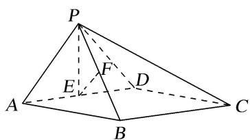
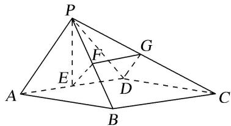

> [!faq]- 《专题08 立体几何中平行与垂直的证明问题-立体几何（文科）》例题解析
>
> > [!success]- **【答案】** 详见解析
>
> > [!note]- **【分析】**
> > 本题未单列分析。
>
> > [!note]- **【解析】**
> > (1)求证： $PE \perp BC;$
> > (2)求证：平面 $PAB \perp$ 平面 PCD;
> > (3)求证： $EF \parallel$ 平面 PCD.
> > 
> > 10. 解析
> > (1) 因为 $PA = PD$ , $E$ 为 $AD$ 的中点, 所以 $PE \perp AD$ .
> > 因为底面 ABCD 为矩形，所以 BC // AD．所以 $PE \perp BC$ .
> > (2)因为底面 ABCD 为矩形，所以 $AB \perp AD$ 。又因为平面 $PAD \perp$ 平面 ABCD，
> > 平面 $PAD \cap$ 平面 ABCD = AD, AB ⊂ 平面 ABCD，所以 $AB \perp$ 平面 PAD，且 $PD \subset$ 平面 PAD. 所以 $AB \perp PD$ . 又因为 $PA \perp PD$ ，且 $PA \cap AB = A$ ，所以 $PD \perp$ 平面 PAB. 又 $PD \subset$ 平面 PCD,
> > 所以平面 $PAB \perp$ 平面 PCD.
> > (3)如图，取 PC 中点 G，连接 FG，DG.
> > 
> > 因为 F, G 分别为 PB, PC 的中点, 所以 $FG \parallel BC$ , $FG = \frac{1}{2} BC$ .
> > 因为 ABCD 为矩形，且 E 为 AD 的中点，所以 $DE \parallel BC$ ， $DE = \frac{1}{2} BC$ .
> > 所以 $DE \parallel FG$ ，且 DE = FG。所以四边形 DEFG 为平行四边形。所以 $EF \parallel DG$ 。
> > 又因为 $EF \not\subset$ 平面 PCD， $DG \subset$ 平面 PCD，所以 $EF \parallel$ 平面 PCD.
