<!-- source-part:1 pages:1-23 -->

(2)垂面模型：已知条件中有一条直线垂直于一个平面，就是墙角模型.

## 专题08 立体几何中的建系求(设)点问题

## 一、空间直角坐标系

1. 空间直角坐标系：在空间选定一点 $O$ 和一个单位正交基底 $\{i, j, k\}$ ，以 $O$ 为原点，分别以 $i, j, k$ 的方向为正方向，以它们的长为单位长度建立三条数轴： $x$ 轴、 $y$ 轴、 $z$ 轴，它们都叫做坐标轴，这时我们就建立了一个空间直角坐标系 $Oxyz$ .

2. 相关概念: $O$ 叫做原点, $\mathbf{i}, \mathbf{j}, \mathbf{k}$ 都叫做坐标向量, 通过每两条坐标轴的平面叫做坐标平面, 分别称为 $Oxy$ 平面、 $Oyz$ 平面、 $Ozx$ 平面, 它们把空间分成八个部分.

注意点：
(1)基向量： $|i|=|j|=|k|=1,\quad i\cdot j=i\cdot k=j\cdot k=0.$

(2)画空间直角坐标系 Oxyz 时，一般使 $\angle xOy=135^{\circ}$ (或 $45^{\circ}$ )， $\angle yOz=90^{\circ}$ .

(3)建立的坐标系均为右手直角坐标系.

## 二、空间直角坐标系的建立

1. 建立空间直角坐标系的原则

尽可能的让更多的点位于 x 轴，y 轴，z 轴上或位于坐标平面 Oxy，Oyz，Ozx 内.

2. 空间直角坐标系建立的模型

(1)墙角模型：已知条件中有过一点两两垂直的三条直线，就是墙角模型.

建系：以该点为原点，分别以两两垂直的三条直线为 $x$ 轴， $y$ 轴， $z$ 轴，建立空间直角坐标系 $Oxyz$ ，当然条件不明显时，要先证明过一点的三条直线两两垂直(即一个线面垂直 + 面内两条线垂直)，这个过程不能省略。然后建系。

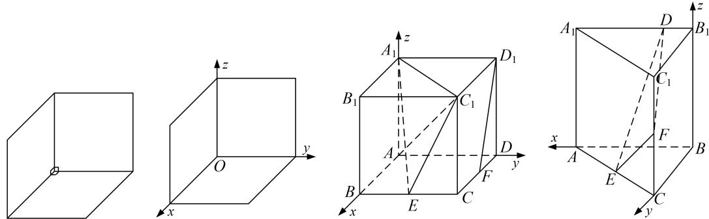

情形1 垂下(上)模型：直线竖直，平面水平，大部分题目都是这种类型．如图，此情形包括垂足在平面图形的顶点处、垂足在平面图形的边上(中点多)和垂足在平面图形的内部三种情况．第一种建系方法为以垂足为坐标原点，垂线的向上方向为z轴，平面图形的一边为x轴或y轴，在平面图形中，过原点作x轴或y轴的垂线为y轴或x轴(其中很多题目是连接垂足与平面图形的另一顶点)建立空间直角坐标系．第二种建系方法为以垂足为坐标原点，垂线的向上方向为z轴，垂足所在的一边为x轴或y轴，在平面图形中，过原点作x轴或y轴的垂线为y轴或x轴(其中很多题目是连接垂足与平面图形的另一顶点)建立空间直角坐标系．第三种建系方法为以垂足为坐标原点，垂线的向上方向为z轴，连接垂足与平面图形的一顶点所在直线为为x轴或y轴，在平面图形中，过原点作x轴或y轴的垂线为y轴或x轴(其中很多题目是连接垂足与平面图形的另一顶点)建立空间直角坐标系.

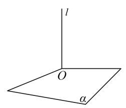

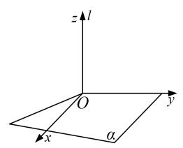  
图1-1

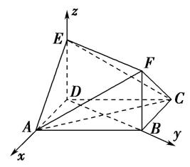

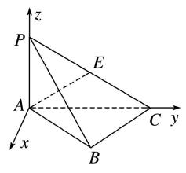

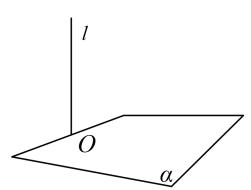

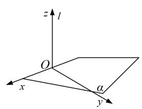  
图1-2

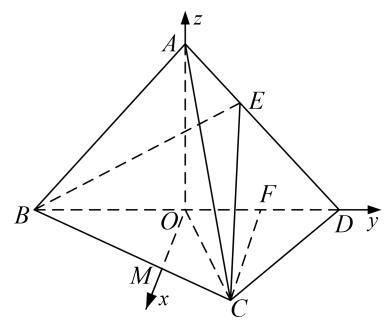

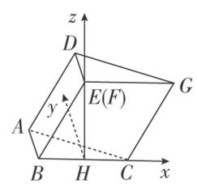

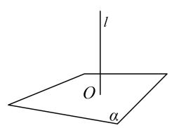

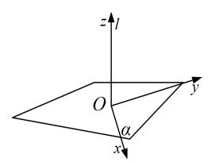

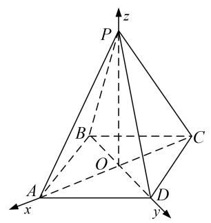

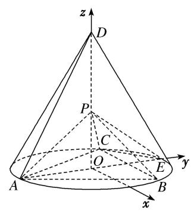  
图1-3

情形 2 垂左(右)模型：直线水平，平面竖直，这种类型的题目很少．各种情况如图，建系方法可类比情形 1.

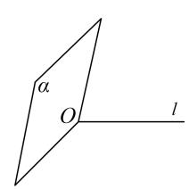

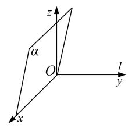  
图2-1

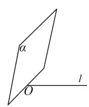

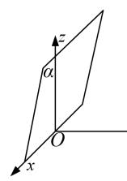  
图2-2

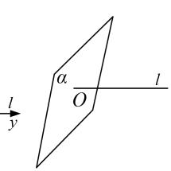

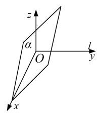  
图2-3

情形 3 垂后(前)模型：直线水平，平面竖直，这种类型的题目很少．各种情况如图，建系方法可类比情形 1.

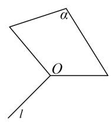

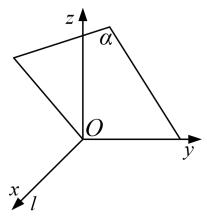  
图3-1

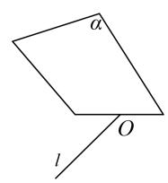

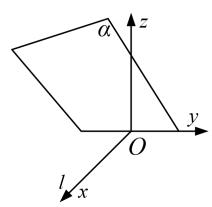  
图3-2

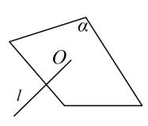

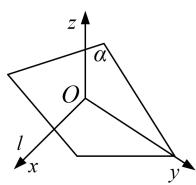  
图3-3

注意点：1．同一个几何体可以有不同的建系方法，其坐标也会对应不同．但是通过坐标所得到的结论(位置关系，数量关系）是一致的.

2. 与垂直相关的定理与结论

(1)线线垂直(相交垂直):

①正方形，矩形，直角梯形；

②等腰三角形底边上的中线与底边垂直（三线合一）；

③菱形的对角线相互垂直；

④勾股定理逆定理：若 $AC^{2}+CB^{2}=AB^{2}$ ，则 $AC\perp CB$ .

(2)线面垂直:

①如果一条直线与一个平面上的两条相交直线垂直，则这条直线与该平面垂直；

②两条平行线，如果其中一条与平面垂直，那么另外一条也与这个平面垂直；

③两个平面垂直，则其中一个平面上垂直交线的直线与另一个平面垂直；

④直棱柱的侧棱与底面垂直.

## 三、空间点的坐标

## 1. 点的坐标

在空间直角坐标系 $Oxyz$ 中， $i, j, k$ 为坐标向量，对空间任意一点 $A$ ，对应一个向量 $\overrightarrow{OA}$ ，且点 $A$ 的位置由向量 $\overrightarrow{OA}$ 唯一确定，由空间向量基本定理，存在唯一的有序实数组 $(x, y, z)$ ，使 $\overrightarrow{OA} = xi + yj + zk$ 。在单位正交基底 $\{i, j, k\}$ 下与向量 $\overrightarrow{OA}$ 对应的有序实数组 $(x, y, z)$ ，叫做点 $A$ 在空间直角坐标系中的坐标，记作 $A(x, y, z)$ ，其中 $x$ 叫做点 $A$ 的横坐标， $y$ 叫做点 $A$ 的纵坐标， $z$ 叫做点 $A$ 的竖坐标。

## 2. 点的坐标的求法

建系之后要能够快速准确的写出(算出)点的坐标，按照特点可以分为可直接写的点和需要计算的点下列两类.

## 可直接写的点

(1)坐标轴、坐标平面上的点的坐标

<table><tr><td>点的位置</td><td>x轴上</td><td>y轴上</td><td>z轴上</td><td>Oxy平面内</td><td>Oyz平面内</td><td>Ozx平面内</td></tr><tr><td>点的坐标</td><td>(x,0,0)</td><td>(0,y,0)</td><td>(0,0,z)</td><td>(x,y,0)</td><td>(0,y,z)</td><td>(x,0,z)</td></tr></table>

记忆：“在哪哪非零，其他都为零”.

(2) 空间点的对称点

<table><tr><td>初始点的坐标</td><td>(x,y,z)</td><td>(x,y,z)</td><td>(x,y,z)</td><td>(x,y,z)</td><td>(x,y,z)</td><td>(x,y,z)</td></tr><tr><td>对称轴(平面)</td><td>x轴上</td><td>y轴上</td><td>z轴上</td><td>Oxy平面内</td><td>Oyz平面内</td><td>Ozx平面内</td></tr><tr><td>对称点的坐标</td><td>(x,-y,-z)</td><td>(-x,y,-z)</td><td>(-x,-y,z)</td><td>(x,y,-z)</td><td>(-x,y,z)</td><td>(x,-y,z)</td></tr></table>

记忆 “关于谁对称，谁保持不变，其余坐标相反” .

(3) 空间点在坐标平面投影点的坐标

<table><tr><td>初始点的坐标</td><td> $(x, y, z)$ </td><td> $(x, y, z)$ </td><td> $(x, y, z)$ </td></tr><tr><td>坐标平面</td><td>Oxy 平面内</td><td>Oyz 平面内</td><td>Ozx 平面内</td></tr><tr><td>投影点的坐标</td><td> $(x, y, 0)$ </td><td> $(0, y, z)$ </td><td> $(x, 0, z)$ </td></tr></table>

图1

记忆 “投影到哪哪不变，第三个坐标为零”。

用法：以上规律一般逆用，在写空间中点的坐标时，先写坐标平面内的投影点的坐标，再确定第三个坐标，而第三个坐标为该点到该坐标平面的距离。如在棱长为1的正方体中的点 $B_{1}$ ，在Oxy平面内的投影为B，而 $B(1,1,0)$ ，则 $B_{1}(1,1,1)$ 。

需要计算的点

(1) 利用三角函数计算

点在 $Oxy$ 坐标平面内，如图
(1)，已知在空间直角坐标系 $Oxyz$ 中， $\angle xOM = \alpha$ ， $OM = m$ ，则 $x = m\cos \alpha$ ， $y = m\sin \alpha$ ，即 $M(m\cos \alpha, m\sin \alpha, 0)$ .

点在 $Oxz$ 坐标平面内，如图
(2)，已知在空间直角坐标系 $Oxyz$ 中， $\angle xON = \beta$ ， $ON = n$ ，则 $x = n\cos \beta$ ， $z = n\sin \beta$ ，即 $N(n\cos \beta, 0, n\sin \beta)$ .

点在 $Oyz$ 坐标平面内，如图
(3)，已知在空间直角坐标系 $Oxyz$ 中， $\angle yOP = \gamma$ ， $OP = p$ ，则 $y = p\cos \gamma$ ， $z = p\sin \gamma$ ，即 $P(0, p\cos \gamma, p\sin \gamma)$ .

记忆 “与哪个轴的夹角已知，该轴上的坐标就是该点与原点的距离与夹角的余弦的乘积，另一个轴上的坐标就是该点与原点的距离与夹角的正弦的乘积，第三个轴上的坐标为零”。

  
图2

图3  

(2) 利用中点坐标公式计算

$A(x_{1}, y_{1}, z_{1}), B(x_{2}, y_{2}, z_{2})$ ，则 AB 中点 $M(\frac{x_{1}+x_{2}}{2}, \frac{y_{1}+y_{2}}{2}, \frac{z_{1}+z_{2}}{2})$ .

(3) 利用向量关系计算 (先设再求)

向量坐标化后，向量的关系也可转化为坐标的关系，进而可以求出一些位置不好的点的坐标，方法通常是先设出所求点的坐标，再选取向量，利用向量关系解出变量的值.

例如：已知 $A(1, 0, 0)$ ， $B(1, 1, 0)$ ， $C(1, 1, 1)$ ，且 $\overrightarrow{AB} = \overrightarrow{CD}$ ，求 D 点的坐标.

由已知得， $\overrightarrow{AB}=(0,1,0)$ ，设 $D(x,y,z)$ ，则 $\overrightarrow{CD}=(x-1,y-1,z-1)$ ，因为 $\overrightarrow{AB}=\overrightarrow{CD}$ ，所以 $\begin{cases}x-1=0\\y-1=0\\z-1=0\end{cases}$ ，

解得， $\left\{\begin{aligned}x&=1\\ y&=0\\ z&=1\end{aligned}\right.$ 所以 $D(1,0,1)$ .

3. 点的坐标的设法

在解决探索性问题中点的存在性时，经常需要设出点的坐标．如果所求点的坐标设为 $(x, y, z)$ ，则三个变量需要列三个方程，导致运算量增大．为了减少变量数量，所以通常用以下设法(维度等于变量个数).

(1)直线（一维）上的点：用一个变量就可以表示出所求点的坐标.

依据 平面向量共线定理：向量 $a(a \neq 0)$ 与 b 共线的充要条件是存在唯一一个实数 $\lambda$ ，使 $b = \lambda a$ .

例如：已知 $A(4,3,2),B(5,3,4)$ ，那么直线 $AB$ 上的某点 $P(x,y,z)$ 的坐标可用一个变量表示.因为 $\overrightarrow{AB} = (1,0,2),\overrightarrow{AP} = (x - 4,y - 3,z - 2)$ ，则 $\overrightarrow{AP} = \lambda \overrightarrow{AB}$ ，所以 $\left\{ \begin{array}{l}x - 4 = \lambda \\ y - 3 = 0\\ z - 2 = 2\lambda \end{array} \right.$ 解得， $\left\{ \begin{array}{l}x = \lambda +4\\ y = 3\\ z = 2\lambda +2 \end{array} \right.$ 所以可设 $P(\lambda +4,3,2\lambda +2)$

(2)平面（二维）上的点：用两个变量可以表示所求点坐标.

依据 平面向量基本定理：如果 $e_{1}, e_{2}$ 是同一平面内的两个不共线向量，那么对于这一平面内的任一向量 a，有且只有一对实数 $\lambda_{1}, \lambda_{2}$ ，使 $a = \lambda_{1} e_{1} + \lambda_{2} e_{2}$ .

例如：已知 $A(4, 3, 2)$ ， $B(5, 3, 4)$ ， $C(6, 4, 5)$ ，则平面 $ABC$ 上的某点 $P(x, y, z)$ 的坐标可用两个变量表示.

因为 $\overrightarrow{AB} = (1,0,2)$ ， $\overrightarrow{BC} = (1,1,1)$ ， $\overrightarrow{AP} = (x - 4,y - 3,z - 2)$ ，则 $\overrightarrow{AP} = \lambda \overrightarrow{AB} +\mu \overrightarrow{BC}$ ，所以 $\left\{ \begin{array}{l}x - 4 = \lambda +\mu \\ y - 3 = \mu \\ z - 2 = 2\lambda +\mu \end{array} \right.$ 解得， $\left\{ \begin{array}{ll}x = \lambda +\mu +4\\ y = \mu +3\\ z = 2\lambda +\mu +2 \end{array} \right.$ 所以可设 $P(\lambda +\mu +4,\mu +3,2\lambda +\mu +2).$

## 【例题选讲】

[例 1]
![[高中/总复习/专题/立体几何/专题08 立体几何中的建系求(设)点问题-立体几何（理科）/专题08_立体几何中的建系求_设_点问题/例题/Q00043598.md]]
![[高中/总复习/专题/立体几何/专题08 立体几何中的建系求(设)点问题-立体几何（理科）/专题08_立体几何中的建系求_设_点问题/例题/Q00043599.md]]
![[高中/总复习/专题/立体几何/专题08 立体几何中的建系求(设)点问题-立体几何（理科）/专题08_立体几何中的建系求_设_点问题/例题/Q00043600.md]]
![[高中/总复习/专题/立体几何/专题08 立体几何中的建系求(设)点问题-立体几何（理科）/专题08_立体几何中的建系求_设_点问题/例题/Q00043601.md]]
![[高中/总复习/专题/立体几何/专题08 立体几何中的建系求(设)点问题-立体几何（理科）/专题08_立体几何中的建系求_设_点问题/对点训练/Q00050975.md]]
![[高中/总复习/专题/立体几何/专题08 立体几何中的建系求(设)点问题-立体几何（理科）/专题08_立体几何中的建系求_设_点问题/对点训练/Q00050976.md]]
![[高中/总复习/专题/立体几何/专题08 立体几何中的建系求(设)点问题-立体几何（理科）/专题08_立体几何中的建系求_设_点问题/对点训练/Q00039676.md]]
![[高中/总复习/专题/立体几何/专题08 立体几何中的建系求(设)点问题-立体几何（理科）/专题08_立体几何中的建系求_设_点问题/对点训练/Q00039677.md]]
![[高中/总复习/专题/立体几何/专题08 立体几何中的建系求(设)点问题-立体几何（理科）/专题08_立体几何中的建系求_设_点问题/对点训练/Q00043602.md]]
![[高中/总复习/专题/立体几何/专题08 立体几何中的建系求(设)点问题-立体几何（理科）/专题08_立体几何中的建系求_设_点问题/例题/Q00043603.md]]
![[高中/总复习/专题/立体几何/专题08 立体几何中的建系求(设)点问题-立体几何（理科）/专题08_立体几何中的建系求_设_点问题/例题/Q00043604.md]]
![[高中/总复习/专题/立体几何/专题08 立体几何中的建系求(设)点问题-立体几何（理科）/专题08_立体几何中的建系求_设_点问题/例题/Q00043605.md]]
![[高中/总复习/专题/立体几何/专题08 立体几何中的建系求(设)点问题-立体几何（理科）/专题08_立体几何中的建系求_设_点问题/例题/Q00043606.md]]
![[高中/总复习/专题/立体几何/专题08 立体几何中的建系求(设)点问题-立体几何（理科）/专题08_立体几何中的建系求_设_点问题/例题/Q00043607.md]]
![[高中/总复习/专题/立体几何/专题08 立体几何中的建系求(设)点问题-立体几何（理科）/专题08_立体几何中的建系求_设_点问题/例题/Q00043608.md]]
![[高中/总复习/专题/立体几何/专题08 立体几何中的建系求(设)点问题-立体几何（理科）/专题08_立体几何中的建系求_设_点问题/对点训练/Q00050977.md]]
![[高中/总复习/专题/立体几何/专题08 立体几何中的建系求(设)点问题-立体几何（理科）/专题08_立体几何中的建系求_设_点问题/对点训练/Q00050978.md]]
![[高中/总复习/专题/立体几何/专题08 立体几何中的建系求(设)点问题-立体几何（理科）/专题08_立体几何中的建系求_设_点问题/对点训练/Q00039682.md]]
![[高中/总复习/专题/立体几何/专题08 立体几何中的建系求(设)点问题-立体几何（理科）/专题08_立体几何中的建系求_设_点问题/对点训练/Q00039683.md]]
![[高中/总复习/专题/立体几何/专题08 立体几何中的建系求(设)点问题-立体几何（理科）/专题08_立体几何中的建系求_设_点问题/对点训练/Q00039684.md]]
![[高中/总复习/专题/立体几何/专题08 立体几何中的建系求(设)点问题-立体几何（理科）/专题08_立体几何中的建系求_设_点问题/对点训练/Q00039685.md]]
![[高中/总复习/专题/立体几何/专题08 立体几何中的建系求(设)点问题-立体几何（理科）/专题08_立体几何中的建系求_设_点问题/对点训练/Q00039686.md]]
![[高中/总复习/专题/立体几何/专题08 立体几何中的建系求(设)点问题-立体几何（理科）/专题08_立体几何中的建系求_设_点问题/对点训练/Q00039687.md]]
