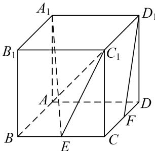
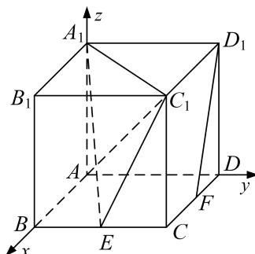
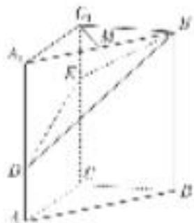

<!-- question-source:start -->
(1)如图，在棱长为 2 的正方体 $ABCD-A_{1}B_{1}C_{1}D_{1}$ 中，E 为棱 BC 的中点，F 为棱 CD 的中点．试建立适当的空间直角坐标系并确定各点坐标.

## 解析 本题属墙角模型建系类型

因为正方体 $ABCD - A_1B_1C_1D_1$ ，所以 $AB$ ， $AD$ ， $AA_{1}$ 两两垂直．以 $A$ 为坐标原点， $AB$ ， $AD$ ， $AA_{1}$ 为坐标轴建立空间直角坐标系，如图所示.

则 $A(0, 0, 0)$ ， $B(2, 0, 0)$ ， $D(0, 2, 0)$ ， $A_{1}(0, 0, 2)$ ， $C(2, 2, 0)$ ， $B_{1}(2, 0, 2)$ ， $D_{1}(0, 2, 2)$ ， $C_{1}(2, 2, 2)$ ， $E(2, 1, 0)$ ， $F(1, 2, 0)$ .

(2)如图，在三棱柱 $ABC - A_{1}B_{1}C_{1}$ 中， $CC_{1} \perp$ 平面 $ABC$ ， $AC \perp BC$ ， $AC = BC = 2$ ， $CC_{1} = 3$ ，点 $D$ ， $E$ 分别在棱 $AA_{1}$ 和棱 $CC_{1}$ 上，且 AD=1, CE=2, M 为棱 $A_{1}B_{1}$ 的中点．试建立适当的空间直角坐标系并确定各点坐标.

<!-- question-source:end -->

![[高中/总复习/专题/立体几何/专题08 立体几何中的建系求(设)点问题-立体几何（理科）/专题08_立体几何中的建系求_设_点问题/例题/answers/Q00043598A1.md]]
