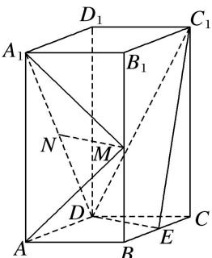

<!-- question-source:start -->
(2)如图, 直四棱柱 $ABCD - A_{1}B_{1}C_{1}D_{1}$ 的底面是菱形, $AA_{1} = 4$ , $AB = 2$ , $\angle BAD = 60^{\circ}$ , $E$ , $M$ , $N$ 分别是 $BC$ , $BB_{1}$ , $A_{1}D$ 的中点. 试建立适当的空间直角坐标系并确定各点坐标.

<!-- question-source:end -->

![[高中/总复习/专题/立体几何/专题08 立体几何中的建系求(设)点问题-立体几何（理科）/专题08_立体几何中的建系求_设_点问题/例题/answers/Q00043604A1.md]]
