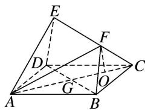

<!-- question-source:start -->
(7)如图, 正方形 $ABCD$ 的边长为 $2 \sqrt{2}$ , 四边形 $BDEF$ 是平行四边形, $BD$ 与 $AC$ 交于点 $G$ , $O$ 为 $GC$ 的中点, $FO = \sqrt{3}$ , 且 $FO \perp$ 平面 $ABCD$ . 试建立适当的空间直角坐标系并确定各点坐标.

<!-- question-source:end -->

![[高中/总复习/专题/立体几何/专题08 立体几何中的建系求(设)点问题-立体几何（理科）/专题08_立体几何中的建系求_设_点问题/例题/answers/Q00043606A1.md]]
