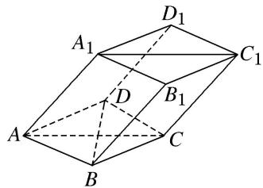

<!-- question-source:start -->
(8)如图，棱柱 $ABCD-A_{1}B_{1}C_{1}D_{1}$ 的所有棱长都等于 2， $\angle ABC$ 和 $\angle A_{1}AC$ 均为 $60^{\circ}$ ，平面 $AA_{1}C_{1}C \perp$ 平面 ABCD，试建立适当的空间直角坐标系并确定各点坐标.

<!-- question-source:end -->

![[高中/总复习/专题/立体几何/专题08 立体几何中的建系求(设)点问题-立体几何（理科）/专题08_立体几何中的建系求_设_点问题/例题/answers/Q00043607A1.md]]
