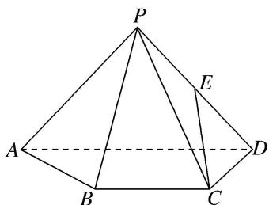

<!-- question-source:start -->
(9)如图，已知四棱锥 $P - ABCD$ ， $\triangle PAD$ 是以 $AD$ 为斜边的等腰直角三角形， $BC / / AD$ ， $CD\bot AD$ ， $PC = AD = 2DC = 2CB = 2$ ， $E$ 为 $PD$ 的中点．试建立适当的空间直角坐标系并确定各点坐标.

<!-- question-source:end -->

![[高中/总复习/专题/立体几何/专题08 立体几何中的建系求(设)点问题-立体几何（理科）/专题08_立体几何中的建系求_设_点问题/例题/answers/Q00043608A1.md]]
