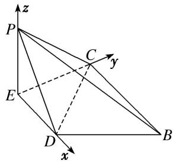

> [!faq]- 《专题08 立体几何中的建系求(设)点问题-立体几何（理科）》例题解析
>
> > [!success]- **【答案】** 详见解析
>
> > [!note]- **【分析】**
> > 本题未单列分析。
>
> > [!note]- **【解析】**
> > 解析 本题属墙角模型建系类型
> >
> > 在题图①中，因为 AB=2BC=2CD，且 D 为 AB 的中点，
> >
> > 所以由平面几何知识，得 $\angle ACB=90^{\circ}$ 。又 E 为 AC 的中点，所以 $DE \parallel BC$ 。
> >
> > 在题图②中， $CE \perp DE$ ， $PE \perp DE$ ，因为平面 $DEP \perp$ 平面 BCED，平面 $DEP \cap$ 平面 BCED = DE， $EP \subset$ 平面 DEP， $EP \perp DE$ ，所以 $EP \perp$ 平面 BCED。又 $CE \subset$ 平面 BCED，所以 $EP \perp CE$ 。
> >
> > 
> >
> > 以 E 为坐标原点， $\overrightarrow{ED},\overrightarrow{EC},\overrightarrow{EP}$ 的方向分别为 x 轴，y 轴，z 轴的正方向建立如图所示的空间直角坐标系。在题图①中，设 BC=2a，则 AB=4a， $AC=2\sqrt{3}a,\quad AE=CE=\sqrt{3}a,\quad DE=a$ 。
> >
> > 则 $P(0, 0, \sqrt{3}a)$ ， $D(a, 0, 0)$ ， $C(0, \sqrt{3}a, 0)$ ， $B(2a, \sqrt{3}a, 0)$ .
> >
> > ## 【对点训练】
