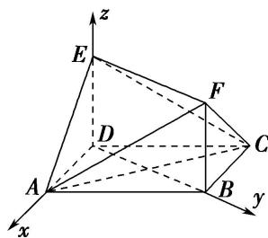

> [!faq]- 《专题08 立体几何中的建系求(设)点问题-立体几何（理科）》例题解析
>
> > [!success]- **【答案】** 详见解析
>
> > [!note]- **【解析】**
> > 解析 本题属垂面模型1-1建系类型
> >
> > 在 $\triangle ABD$ 中， $\angle ABD=\frac{\pi}{6}$ ， $AB=2$ ， $AD=1$ ，由余弦定理，得 $BD=\sqrt{3}$ ，从而 $BD^{2}+AD^{2}=AB^{2}$ ，故 $BD \perp AD$ ，所以 $\triangle ABD$ 为直角三角形且 $\angle ADB=\frac{\pi}{2}$ 。因为 $DE \perp$ 平面 $ABCD$ ， $BD \perp AD$ ，
> >
> > 
> >
> > 所以以点 D 为坐标原点，DA，DB，DE 所在直线分别为 x 轴，y 轴，z 轴建立空间直角坐标系，如图所示．则 $D(0,0,0)$ ， $A(1,0,0)$ ， $B(0,\sqrt{3},0)$ ， $E(0,0,\sqrt{3})$ ， $C(-1,\sqrt{3},0)$ ， $F(0,\sqrt{3},\sqrt{3})$ .
