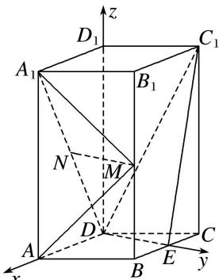

> [!faq]- 《专题08 立体几何中的建系求(设)点问题-立体几何（理科）》例题解析
>
> > [!success]- **【答案】** 详见解析
>
> > [!note]- **【解析】**
> > 解析 本题属垂面模型1-1建系类型
> >
> > 由已知可得 $DE \perp DA$ ，以 D 为坐标原点， $\overrightarrow{DA}$ 的方向为 x 轴正方向，建立如图所示的空间直角坐标系 Dxyz，
> >
> > 
> >
> > 则 $D(0, 0, 0)$ ， $A(2, 0, 0)$ ， $E(0, \sqrt{3}, 0)$ ， $B(1, \sqrt{3}, 0)$ ， $C(-1, \sqrt{3}, 0)$ ， $D_{1}(0, 0, 4)$ ， $A_{1}(2, 0, 4)$ ， $B_{1}(1, \sqrt{3}, 4)$ ， $C_{1}(-1, \sqrt{3}, 4)$ ， $M(1, \sqrt{3}, 2)$ ， $N(1, 0, 2)$ ，
