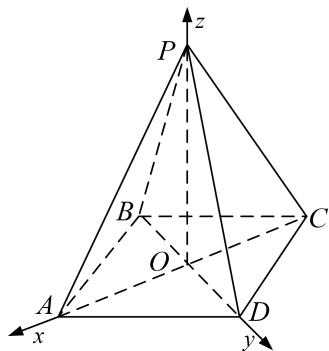

> [!faq]- 《专题08 立体几何中的建系求(设)点问题-立体几何（理科）》例题解析
>
> > [!success]- **【答案】** 详见解析
>
> > [!note]- **【解析】**
> > 解析 本题属垂面模型1-3建系类型
> >
> > 连接 AC，BD 且 $AC \cap BD = O$ ，连接 PO。由已知 ABCD 为菱形，所以 $BD \perp AC$ ，又 PD = PB，
> >
> > 所以 $PO \perp BD$ 。因为 $PA = PC$ ，所以 $PO \perp AC$ ，所以 $PO \perp$ 平面 $ABCD$ ，所以 $PA$ 与平面 $ABCD$ 所成的角为 $\angle PAO$ ，所以 $\angle PAO = 60^\circ$ ，所以 $AO = \frac{1}{2} PA = 1$ ， $PO = \frac{\sqrt{3}}{2} PA = \sqrt{3}$ 。因为 $PA = \sqrt{3} AB$ ，所以 $BO = \frac{\sqrt{3}}{6} PA = \frac{\sqrt{3}}{3}$ 。以 $O$ 为原点， $OA$ ， $OD$ ， $OP$ 分别为 $x$ 轴、 $y$ 轴、 $z$ 轴建立如图所示空间直角坐标系。
> >
> > 
> >
> > 则 $O(0, 0, 0), A(1, 0, 0), D\left[0, \frac{\sqrt{3}}{3}, 0\right], B\left[0, -\frac{\sqrt{3}}{3}, 0\right], C(-1, 0, 0), P(0, 0, \sqrt{3}).$
