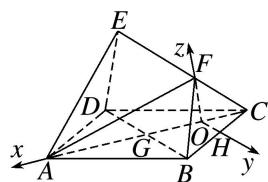

> [!faq]- 《专题08 立体几何中的建系求(设)点问题-立体几何（理科）》例题解析
>
> > [!success]- **【答案】** 详见解析
>
> > [!note]- **【分析】**
> > 本题未单列分析。
>
> > [!note]- **【解析】**
> > 解析 本题属垂面模型1-3建系类型
> >
> > 如图，取 BC 的中点 H，连接 OH，则 $OH \parallel BD$ ，又四边形 ABCD 为正方形，
> >
> > 
> >
> > $\therefore AC \perp BD, \therefore OH \perp AC,$ 故以 O 为原点，建立如图所示的直角坐标系，
> >
> > 则 $O(0, 0, 0)$ ， $A(3, 0, 0)$ ， $C(-1, 0, 0)$ ， $G(1, 0, 0)$ ， $F(0, 0, \sqrt{3})$ ， $D(1, -2, 0)$ ， $B(1, 2, 0)$ ， $E(0, -4, \sqrt{3})$ ，
