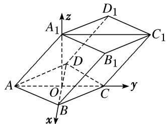

> [!faq]- 《专题08 立体几何中的建系求(设)点问题-立体几何（理科）》例题解析
>
> > [!success]- **【答案】** 详见解析
>
> > [!note]- **【分析】**
> > 本题未单列分析。
>
> > [!note]- **【解析】**
> > 解析 本题属垂面模型1-3建系类型
> > 设 BD 与 AC 交于点 O，则 $BD \perp AC$ ，连接 $A_{1}O$ ，在 $\triangle AA_{1}O$ 中， $AA_{1}=2, AO=1, \angle A_{1}AO=60^{\circ}, \therefore A_{1}O^{2}=AA_{1}^{2}+AO^{2}-2AA_{1}\cdot AO\cos60^{\circ}=3, \therefore AO^{2}+A_{1}O^{2}=AA_{1}^{2}, \therefore A_{1}O \perp AO.$
> > 
> > 由于平面 $AA_{1}C_{1}C \perp$ 平面 ABCD，且平面 $AA_{1}C_{1}C \cap$ 平面 ABCD = AC， $A_{1}O \subset$ 平面 $AA_{1}C_{1}C$ ，
> > $\therefore A_{1}O \perp$ 平面 $ABCD$ 。以 $OB, OC, OA_{1}$ 所在直线分别为 $x$ 轴， $y$ 轴， $z$ 轴，建立如图所示的空间直角坐标系，则 $B(\sqrt{3}, 0, 0), C(0, 1, 0), A_{1}(0, 0, \sqrt{3}), A(0, -1, 0), D(-\sqrt{3}, 0, 0), C_{1}(0, 2, \sqrt{3}), B_{1}(\sqrt{3}, 1, \sqrt{3}), D_{1}(-\sqrt{3}, 1, \sqrt{3})$
