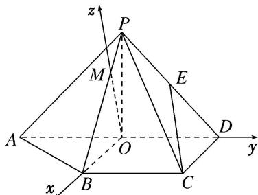
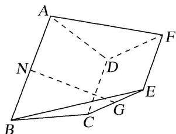

> [!faq]- 《专题08 立体几何中的建系求(设)点问题-立体几何（理科）》例题解析
>
> > [!success]- **【答案】** D
>
> > [!note]- **【解析】**
> > 解析 本题属垂面模型2-1建系类型
> >
> > 设 AD 的中点为 O，连接 OB，OP．∵△PAD 是以 AD 为斜边的等腰直角三角形，
> > ∴OP⊥AD．∵BC= $\frac{1}{2}$ AD=OD，且 BC//OD，
> >
> > 
> >
> > ∴四边形 BCDO 为平行四边形，又∵CD⊥AD，∴OB⊥AD，∵OP∩OB=O，∴AD⊥平面 OPB. 所以是垂面模型的情形 3，过点 O 在平面 POB 内作 OB 的垂线 OM，交 PB 于 M，
> >
> > 以 O 为原点，OB 所在直线为 x 轴，OD 所在直线为 y 轴，OM 所在直线为 z 轴，建立空间直角坐标系，如图．则有 $A(0, -1, 0)$ ， $B(1, 0, 0)$ ， $C(1, 1, 0)$ ， $D(0, 1, 0)$ ．设 $P(x, 0, z)(z > 0)$ ，由 PC = 2，
> >
> > $OP = 1$ ，得 $\left\{ \begin{array}{l}(x - 1)^2 +1 + z^2 = 4,\\ x^2 +z^2 = 1, \end{array} \right.$ 得 $x = -\frac{1}{2},z = \frac{\sqrt{3}}{2}$ 即点 $P\left(-\frac{1}{2},0,\frac{\sqrt{3}}{2}\right)$ 而 $E$ 为 $PD$ 的中点，： $E\left(-\frac{1}{4},\frac{1}{2},\frac{\sqrt{3}}{4}\right).$
> >
> > (10)如图所示的几何体中，四边形 $ABCD$ 是等腰梯形， $AB \parallel CD$ ， $\angle ABC = 60^\circ$ ， $AB = 2BC = 2CD = 4$ ，四边形 $DCEF$ 是正方形， $N$ ， $G$ 分别是线段 $AB$ ， $CE$ 的中点，且二面角 $A - CD - F$ 的大小为 $120^\circ$ 。试建立适当的空间直角坐标系并确定各点坐标。
> >
> > 
> >
> > ## 解析 本题属垂面模型3-1建系类型
> >
> > 设 $CD$ 的中点为 $O$ , $EF$ 的中点为 $P$ , 连接 $NO$ , $OP$ , 易得 $NO \perp CD$ , 以点 $O$ 为原点, 以 $OC$ 所在直线为 $x$ 轴, 以 $NO$ 所在直线为 $y$ 轴, 以过点 $O$ 且与平面 $ABCD$ 垂直的直线为 $z$ 轴建立如图所示的空间直角坐标系.
> >
> > 
> >
> > 因为 $NO \perp CD$ ， $OP \perp CD$ ，所以 $\angle NOP$ 是二面角 $A - CD - F$ 的平面角，则 $\angle NOP = 120^{\circ}$ 所以 $\angle POy = 60^{\circ}$ ，因为 $AB = 4$ ，则 $BC = CD = 2$ ，则 $C(1, 0, 0)$ ， $D(-1, 0, 0)$ ， $B(2, -\sqrt{3}, 0)$ ， $A(-2, -\sqrt{3}, 0)$ ， $N(0, -\sqrt{3}, 0)$ ， $E(1, 1, \sqrt{3})$ ， $F(-1, 1, \sqrt{3})$ ， $P(0, 1, \sqrt{3})$
> >
> > ## 【对点训练】
