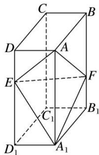
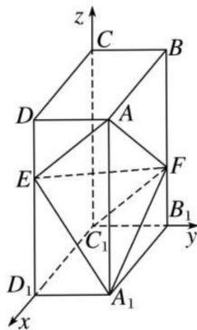

<!-- question-source:start -->
2. 如图，在长方体 $ABCD - A_{1}B_{1}C_{1}D_{1}$ 中，点 $E$ ， $F$ 分别在棱 $DD_{1}$ ， $BB_{1}$ 上，且 $2DE = ED_{1}$ ， $BF = 2FB_{1}$ 。若

AB=2, AD=1, $AA_{1}=3$ ，试建立适当的空间直角坐标系并确定各点坐标.

## 2. 解析 本题属墙角模型建系类型

以 $C_{1}$ 为坐标原点， $C_{1}\overrightarrow{D}_{1}, C_{1}\overrightarrow{B}_{1}, C_{1}\overrightarrow{C}$ 的方向分别为 x 轴，y 轴，z 轴正方向，建立空间直角坐标系 $C_{1}xyz$ .

则 $C_{1}(0,0,0)$ ， $D_{1}(2,0,0)$ ， $B_{1}(0,1,0)$ ， $A_{1}(2,1,0)$ ， $C(0,0,3)$ ， $D(2,0,3)$ ， $B(0,1,3)$ ， $A(2,1,3)$ ， $E(2,0,2)$ ， $F(0,1,1)$ .
<!-- question-source:end -->
