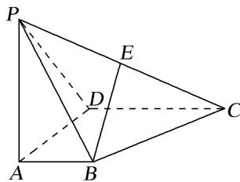

<!-- question-source:start -->
3. 如图，在四棱锥 $P - ABCD$ 中， $PA \perp$ 底面 $ABCD$ ， $AD \perp AB$ ， $AB // DC$ ， $AD = DC = AP = 2$ ， $AB = 1$ ，点 $E$ 为棱 $PC$ 的中点，试建立适当的空间直角坐标系并确定各点坐标。

<!-- question-source:end -->

![[高中/总复习/专题/立体几何/专题08 立体几何中的建系求(设)点问题-立体几何（理科）/专题08_立体几何中的建系求_设_点问题/对点训练/answers/Q00039676A1.md]]
