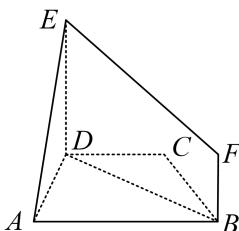
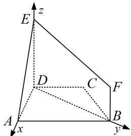

<!-- question-source:start -->
1. 如图所示，在梯形 $ABCD$ 中， $AB \parallel CD$ ， $AD = DC = CB = 1$ ， $\angle BCD = 120^\circ$ ，四边形 $BFED$ 是以 $BD$ 为直角腰的直角梯形， $DE = 2BF = 2$ ，平面 $BFED \perp$ 平面 $ABCD$ ，试建立适当的空间直角坐标系并确定各点坐标.

## 1. 解析 本题属垂面模型 1-1 建系类型

在梯形 ABCD 中，因为 $AB \parallel CD$ ，AD = DC = CB = 1， $\angle BCD = 120^{\circ}$ ，

所以 $\angle CDB = 30^{\circ}$ ，所以 $\angle ADB = 90^{\circ}$ ，所以 $BD\bot AD$

因为平面 $BFED \perp$ 平面 ABCD，平面 $BFED \cap$ 平面 ABCD = BD， $ED \subset$ 平面 BFED，

四边形 BFED 是以 BD 为直角腰的直角梯形，所以 $ED \perp BD$ ，所以 $ED \perp$ 平面 ABCD.

以 D 为原点，分别以 DA，DB，DE 所在直线为 x 轴，y 轴，z 轴建立如图所示的空间直角坐标系，在 $\triangle BCD$ 中， $DC = BC = 1$ ， $\angle BCD = 120^{\circ}$ ，由余弦定理得 $BD = \sqrt{3}$ 则 $D(0,0,0),A(1,0,0),B(0,\sqrt{3},0),E(0,0,2),F(0,\sqrt{3},1).$

<!-- question-source:end -->
