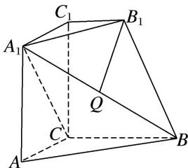

<!-- question-source:start -->
2. 如图，在几何体 $ABC - A_{1}B_{1}C_{1}$ 中，平面 $A_{1}ACC_{1} \perp$ 底面 $ABC$ ，四边形 $A_{1}ACC_{1}$ 是正方形， $B_{1}C_{1} // BC$ ， $Q$ 是 $A_{1}B$ 的中点，且 $AC = BC = 2B_{1}C_{1} = 2$ ， $\angle ACB = \frac{2\pi}{3}$ ，试建立适当的空间直角坐标系并确定各点坐标。

<!-- question-source:end -->

![[高中/总复习/专题/立体几何/专题08 立体几何中的建系求(设)点问题-立体几何（理科）/专题08_立体几何中的建系求_设_点问题/对点训练/answers/Q00039681A1.md]]
