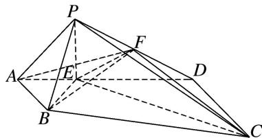
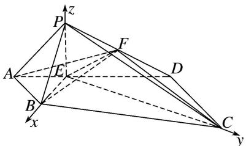
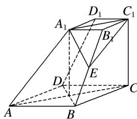
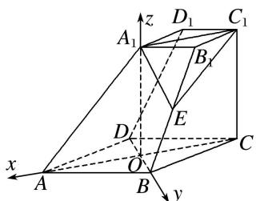

<!-- question-source:start -->
5. 如图, 在四棱锥 $P - ABCD$ 中, 侧面 $PAD \perp$ 底面 $ABCD$ , 底面 $ABCD$ 为直角梯形, 其中 $AB \parallel CD$ , $\angle CDA = 90^{\circ}$ , $CD = 2AB = 2$ , $AD = 3$ , $PA = \sqrt{5}$ , $PD = 2\sqrt{2}$ , 点 $E$ 在棱 $AD$ 上且 $AE = 1$ , 点 $F$ 为棱 $PD$ 的中点,

试建立适当的空间直角坐标系并确定各点坐标.

## 5. 解析 本题属垂面模型1-2建系类型

在 Rt△ABE 中，由 AB=AE=1，得 $\angle AEB=45^{\circ}$ ，
同理在 Rt△CDE 中，由 CD=DE=2，得 $\angle DEC=45^{\circ}$ ，所以 $\angle BEC=90^{\circ}$ ，即 $BE\perp EC$ .
在△PAD中， $\cos\angle PAD=\frac{PA^{2}+AD^{2}-PD^{2}}{2PA\cdot AD}=\frac{5+9-8}{2\times3\times\sqrt{5}}=\frac{\sqrt{5}}{5}$ 在△PAE中， $PE^{2}=PA^{2}+AE^{2}-2PA\cdot AE\cdot\cos\angle PAE=5+1-2\times\sqrt{5}\times1\times\frac{\sqrt{5}}{5}=4$ 所以 $PE^{2} + AE^{2} = PA^{2}$ ，即 $PE \perp AD$ .
又平面 PAD⊥平面 ABCD，平面 PAD∩平面 ABCD=AD，PE⊂平面 PAD，
所以 PE⊥平面 ABCD，所以 PE⊥BE，所以 EB，EC，EP 两两垂直.
故以 E 为坐标原点，以射线 EB，EC，EP 分别为 x 轴、y 轴、z 轴的正半轴建立如图所示的空间直角坐标系，则

$E(0, 0, 0), B(\sqrt{2}, 0, 0), C(0, 2\sqrt{2}, 0), P(0, 0, 2), A\left(\frac{\sqrt{2}}{2}, -\frac{\sqrt{2}}{2}, 0\right), D(-\sqrt{2}, \sqrt{2}, 0), F\left(-\frac{\sqrt{2}}{2}, \frac{\sqrt{2}}{2}, 1\right)$ 6. 如图，在四棱台 $ABCD-A_{1}B_{1}C_{1}D_{1}$ 中，底面 ABCD 是菱形， $CC_{1} \perp$ 底面 ABCD，且 $\angle BAD=60^{\circ}$ ， $CD=CC_{1}=2C_{1}D_{1}=4$ ，E 是棱 $BB_{1}$ 的中点，试建立适当的空间直角坐标系并确定各点坐标.

## 6. 解析 本题属垂面模型1-3建系类型

如图，设 AC 交 BD 于点 O，依题意， $A_{1}C_{1}//OC$ 且 $A_{1}C_{1}=OC$ ，

所以四边形 $A_{1}OCC_{1}$ 为平行四边形，所以 $A_{1}O \parallel CC_{1}$ ，且 $A_{1}O = CC_{1}$ 。所以 $A_{1}O \perp$ 底面 ABCD。以 O 为原点，OA，OB， $OA_{1}$ 所在直线分别为 x 轴，y 轴，z 轴建立空间直角坐标系 O - xyz。

则 $A(2\sqrt{3}, 0, 0)$ ， $A_{1}(0, 0, 4)$ ， $B(0, 2, 0)$ ， $D(0, -2, 0)$ ， $C(-2\sqrt{3}, 0, 0)$ ， $C_{1}(-2\sqrt{3}, 0, 4)$ ， $\overrightarrow{AB} = (-2\sqrt{3}, 2, 0)$ 。由 $\overrightarrow{A_{1}B_{1}} = \frac{1}{2}\overrightarrow{AB}$ ，得 $B_{1}(-\sqrt{3}, 1, 4)$ 。因为 E 是棱 $BB_{1}$ 的中点，所以 $E\left(-\frac{\sqrt{3}}{2}, \frac{3}{2}, 2\right)$ ，同理， $D_{1}(-\sqrt{3}, -1, 4)$ 。
<!-- question-source:end -->
